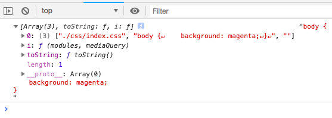
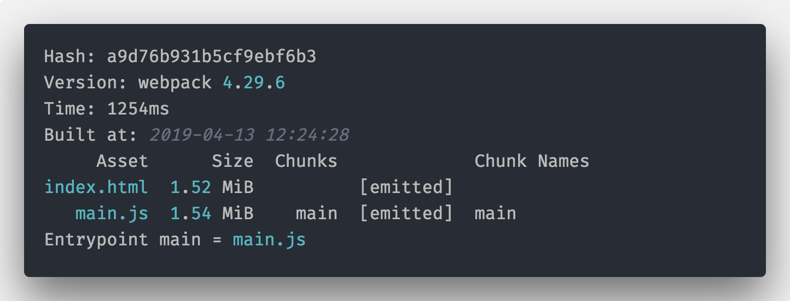
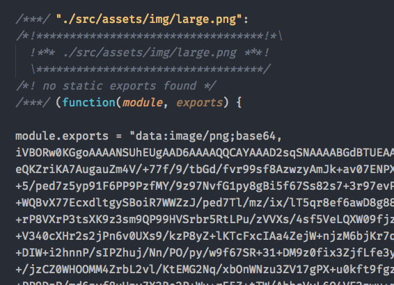

* [主要内容](https://front-end.toimc.com/notes-page/devops/webpack/#主要内容)
* [官方资源](https://front-end.toimc.com/notes-page/devops/webpack/#官方资源)
* [常见的问题](https://front-end.toimc.com/notes-page/devops/webpack/#常见的问题)
* 环境准备
  * [安装Node.js](https://front-end.toimc.com/notes-page/devops/webpack/#安装node-js)
  * [Node.js 包管理工具](https://front-end.toimc.com/notes-page/devops/webpack/#node-js-包管理工具)
  * [NPM 的常用命令](https://front-end.toimc.com/notes-page/devops/webpack/#npm-的常用命令)
  * [NPM Scripts](https://front-end.toimc.com/notes-page/devops/webpack/#npm-scripts)
  * [安装 Webpack-cli](https://front-end.toimc.com/notes-page/devops/webpack/#安装-webpack-cli)


随着 Web 前端的不断发展，传统网页开发在逐渐往 Web 应用（Web Application，简称 WebAPP）的开发方式转变，页面开始变得越来越复杂，复杂的应用场景必然引起技术的进步，出现新的技术手段来解决现有问题。

前端模块化和工程化的呼声越来越高，随着前些年大行其道的 Grunt、Gulp、FIS（百度） 等构建工具的发展，带动了一波前端工程化热。

近几年，经过 React、Vue 库这些年的扩张，大型 Webapp 不再局限于手写 jQuery 操作 DOM，让大型 Webapp 有了全新的开发体验。在这个过程中，前端逐渐发展成了模块化和单页应用（single-page application，简称 SPA）为主的形式，在这种形态和 React、Vue 这些库的普及下，Webpack 越来越被更多成为主流构建工具。

Webpack 绝不仅仅是一个打包工具，系统的学习 Webpack 之后，我们可以基于 Webpack 做很多提升研发效率的事情。作为笔试必考、面试必问、工作必用的内容，Webpack 正变得越来越重要，尤其对于大型公司，会不会 Webpack 甚至能直接决定你是否被录用。

**除了Webpack还有Vite（Vue的作者尤雨溪开发的）、Rollup、Parcel，也是打包工具，只是它们的应用面不一样。**

## [#](https://front-end.toimc.com/notes-page/devops/webpack/#主要内容)主要内容

* Webpack 开发配置
* Webpack 内核原理
* 工程化实践

## [#](https://front-end.toimc.com/notes-page/devops/webpack/#官方资源)官方资源

英文文档：[https://webpack.js.org/(opens new window)](https://webpack.js.org/)

中文文档：[https://webpack.docschina.org/(opens new window)](https://webpack.docschina.org/)

## [#](https://front-end.toimc.com/notes-page/devops/webpack/#常见的问题)常见的问题

* 什么是模块化？

  模块化是指解决一个复杂问题时自顶向下逐层把系统划分成若干模块的过程，有多种属性，分别反映其内部特性。（百度百科）

  前端模块化一般指得是 JavaScript 的模块，最常见的是 Nodejs 的 NPM 包，每个模块可能是最小甚至是最优的代码组合，也可能是解决某些问题有很多特定模块组成的大模块。

  多模块化的规范：`CommonJS`、`AMD`和`ES6 Module`规范（另外还有`CMD`、`UMD`等）。

* 为什么是 Webpack？

  Webpack 是一个现代 JavaScript 应用程序的静态模块打包器（static module bundler）

* Webpack的工作流程是怎么样的？Webpack可以做什么？

  **webpack 是从入口文件开始，经过模块依赖加载、分析和打包三个流程完成项目的构建**。

  Webpack 还可以轻松的解决传统构建工具解决的问题：

  * 模块化打包，一切皆模块，JS 是模块，CSS 等也是模块；
  * 语法糖转换：比如 ES6 转 ES5、TypeScript；
  * 预处理器编译：比如 Less、Sass 等；
  * 项目优化：比如压缩、CDN；
  * 解决方案封装：通过强大的 Loader 和插件机制，可以完成解决方案的封装，比如 PWA；
  * 流程对接：比如测试流程、语法检测等。

* Webpack 中的概念有哪些？

  五大核心概念：入口、输出、插件、模块转化器、模式。

## [#](https://front-end.toimc.com/notes-page/devops/webpack/#环境准备)环境准备

### [#](https://front-end.toimc.com/notes-page/devops/webpack/#安装node-js)安装Node.js

首先进入 [Node.js 的官网 (opens new window)](https://nodejs.org/zh-cn/)，选择对应系统的[下载包 (opens new window)](https://nodejs.org/zh-cn/download/)进行下载安装，对于 windows 用户，直接下载安装包安装即可，如果是 Macos 用户，推荐使用 [brew (opens new window)](https://brew.sh/index_zh-cn)进行安装。

Node.js 版本众多，包括稳定版和开发版，可能不同的项目需要的 Node.js 版本不同，这里我推荐大家安装 8.9 以上版本，对于已经安装了 Node.js 的朋友，可以使用 [nvm (opens new window)](https://github.com/creationix/nvm)（[windows 版本 (opens new window)](https://github.com/coreybutler/nvm-windows)）对 Node.js 进行进行版本管理，（另外阿里有个 [tnvm (opens new window)](https://github.com/aliyun-node/tnvm)，也是管理 Node.js 版本的，增加了 alinode 版本系列的 Node.js）。

### [#](https://front-end.toimc.com/notes-page/devops/webpack/#node-js-包管理工具)Node.js 包管理工具

Node.js 之所以这么流行，离不开庞大的社区建设，这里第一功劳就是 NPM 团队的贡献，使用 Node.js 写的代码，可以打包发布到 JavaScript 包管理平台 [npmjs.com (opens new window)](https://www.npmjs.com/)（这个存放包的地方一般也被称为仓库）上，当我们项目需要使用某个包（模块）时，可以直接使用包管理工具来安装（下载）对应的包，我们也可以免费注册一个账号，发布自己的公共包和私有包供其他人使用。

NPM 是围绕着[语义版本控制（semver） (opens new window)](https://semver.org/lang/zh-CN/)思想而设计的，我们在软件版本中碰见的：rc、`1.x.x`、`alpha`、`beta`等名词都可以在 [semver.org (opens new window)](http://semver.org/)得到解释介绍，简单来说规范是`主版本号.次版本号.修订号`（`MAJOR.MINOR.PATCH`）：

1.主版本号：当你做了不兼容的 API 修改； 2.次版本号：当你做了向下兼容的功能性新增； 3.修订号：当你做了向下兼容的问题修正；

例如：

```json
{
    "name": "demo",
    "version": "1.0.0",
    "dependencies": {
        "webpack": "^4.29.6"
    }
}
```

* `name`：上面的代码就是表明了这个项目为`demo`，这样如果我们将来发布到 [npmjs.com (opens new window)](https://www.npmjs.com/)会以这个来命名，除了这种方式的名称，还有一种命名的方式是`@scope/name`的方式，是`作用域包`，例如我们用来转化 ES6 语法的`@babel/core`就是`@babel`的作用域，详细介绍可以查看 [package.json 的文档(opens new window)](https://www.npmjs.cn/misc/scope/)
* `dependencies`：是`demo`这个项目的依赖，就是 demo 这个包内离开`webpack`这个包就不能使用了，对应的还有`devdependencies`，开发以来，一般需要二次开发 demo 的时候需要安装的包，实际项目中，`webpack`是构建工具，代码不会直接用 webpack 的 API，而只在开发和打包的时候采用，所以正确做法是放在`devdependencies`中。

注意到`dependencies` 中`webpack` 的后面版本号前面加了`^`，意思是主版本是`4`的最新版本，每次执行安装命令的时候，会更新符合这个规则的最新包，可以在[npm semver range 部分 (opens new window)](https://www.npmjs.cn/misc/semver/#ranges)看到更详细的介绍。

### [#](https://front-end.toimc.com/notes-page/devops/webpack/#npm-的常用命令)NPM 的常用命令

下面介绍下 NPM 的常用命令：安装、删除、初始化、配置。

#### [#](https://front-end.toimc.com/notes-page/devops/webpack/#安装和删除)**安装和删除**

安装某个 NPM 包，使用命令：

```text
npm install packageName

// 简写 
npm i packageName

// 安装特定版本
npm i packageName@x.x.x

// 删除某个 NPM 包
npm uninstall 包名

// dependencies
npm i packageName --save

// devdependencies
npm i packageName --save-dev

// 或者
npm i packageName -D
```

如果执行命令的目录下有`package.json`，则可以直接用`npm install`安装`package.json`中的所有依赖。

#### [#](https://front-end.toimc.com/notes-page/devops/webpack/#本地模式和全局模式)本地模式和全局模式

npm 的包安装，分为本地模式和全局模式，默认是本地模式，即在执行`npm install`命令的当前目录创建`node_modules`，然后下载安装包及其依赖到`node_modules`目录。

全局模式是指安装到全局路径的方式。在 Node.js 的 require 依赖之时，会优先查找自己当前文件的`node_modules`，如果没有，则循环遍历上层的`node_modules`，如果便历到根目录还找不到，则会使用全局模式安装的模块，另外全局模式安装的包可以指定全局命令，只需要在`package.json`增加`bin`字段并且指向包内对应的文件即可。全局安装一个包，使用命令`npm install --global`，`--global`可以简写为`-g`。

#### [#](https://front-end.toimc.com/notes-page/devops/webpack/#初始化一个-npm-项目)初始化一个 NPM 项目

npm init 用来初始化生成一个新的 package.json 文件。

输入`npm init`并且根据对应的提示回答问题，会向用户提问一系列问题。

如果你觉得不用修改默认配置，一路回车就可以了。


> 如果使用了 `-f`（代表`force`）、`-y`（代表`yes`），则跳过提问阶段，直接生成一个新的 `package.json` 文件。

#### [#](https://front-end.toimc.com/notes-page/devops/webpack/#设置-npm-镜像)设置 NPM 镜像

由于 NPM 网站经常不稳定，所以国内有很多镜像可以使用，[淘宝 NPM 镜像 (opens new window)](https://npm.taobao.org/)是国内最大的一家 NPM 镜像网站，还有`cnpm`包可以替换官方 NPM 来使用，使用`cnpm`直接使用淘宝镜像安装 NPM 包。

单次使用镜像方法：

```shell
npm [命令] --registry=https://registry.npmmirror.com
```

设置默认 npm 使用淘宝镜像方法：

```shell
npm config set registry https://registry.npmmirror.com
```

使用下面的命令可以安装 cnpm 包，之后直接像使用 npm 一样使用 cnpm 即可，不需要添加`register`

```shell
npm install -g cnpm --registry=https://registry.npmmirror.com
```

#### [#](https://front-end.toimc.com/notes-page/devops/webpack/#npm-其他常用命令)NPM 其他常用命令

* npm set：设置环境变量，例如：`npm set init-author-name 'Your name'`，初始化的时候会使用默认环境变量；
* npm info：查看某个包的信息，例如：`npm info lodash`；
* npm search：查找 npm 仓库，后面可以跟字符串或者正则表达式，例如：`npm search webpack`；
* npm list：树形的展现当前项目安装的所有模块，以及对应的依赖，例如：`npm list --global`查看全局安装的模块。

> 可以使用npm --help查看

### [#](https://front-end.toimc.com/notes-page/devops/webpack/#npm-scripts)NPM Scripts

NPM 不仅可以用于模块管理，还可以用于执行脚本。

`package.json` 文件中可以添加 `scripts` 字段，用于指定脚本命令，供 NPM 直接调用。例如：

```json
// package.json
{
    "scripts": {
        "build": "webpack",
        "start": "node src/scripts/dev.js"
    }
}
```

在`package.json`添加上面字段之后，可以直接使用`npm run build`和`npm run start`命令了，实际上：

* `npm run build`：相当于执行了当前项目中目录下的`webpack`命令；
* `npm run start`：相当于执行了`node src/scripts/dev.js`。

另外`npm run start`还可以简写成`npm start`。

> Tips：除了 npm 外，还有一些包管理工具，主要是针对 npm 的下载速度慢、`node_modules` 混乱等缺点设计的，例如[yarn (opens new window)](https://yarnpkg.com/)和 [pnpm (opens new window)](https://pnpm.js.org/)。

### [#](https://front-end.toimc.com/notes-page/devops/webpack/#安装-webpack-cli)安装 Webpack-cli

[Webpack-cli (opens new window)](https://github.com/webpack/webpack-cli)是 Webpack 的 CLI （Command-line interface）工具，如果在项目中，我们可以使用下面的方式安装：

```text
npm install webpack-cli --save-dev
```

如果想全局使用`webpack`的命令，可以使用`npm install -g webpack-cli`安装。

> Tips：这里建议在项目中安装 webpack-cli 并且使用 `--save-dev` 的配置将 webpack-cli 放到开发依赖中。

后面使用webpack可以有两种方式：

* 配置scripts脚本

  ```text
  "build": "webpack"
  ```

* 使用`npx`命令

  ```text
  npx webpack
  ```


# 核心概念

## [#](https://front-end.toimc.com/notes-page/devops/webpack/01-核心概念.html#helloworld)HelloWorld

首先是创建项目，创建一个名字为`webpack-learn`的文件夹（这里千万别创建成`webpack`），并且进入文件夹使用`npm init`进行初始化：

```bash
# 创建目录并且进入
# webpack-learn
# 初始化
npm init -y
# 安装 webpack 和 webpack-cli到开发依赖
npm i webpack@5 -D
npm i webpack-cli@4 -D

# 注意这里安装的是webpack 5与webpack-cli 4的版本
```

创建目录src，其结构如下：


创建`hello-world.js`文件：

```text
module.exports = 'hello world';
```

创建 `index.js`文件：

```text
const sayHello = require('./hello-world')

console.log(sayHello)
```

下面尝试一下webpack打包：

```text
// 方法一
npx webpack

// 方法二 scripts中添加 "start": "webpack"
npm run start
```

说明：

* `module.exports`与`require`是node.js所遵循的`Commonjs`规范；
* `module.exports`导出了一个字符串；
* `require`引用的如果是js文件，则可以省略；

打包结果：


执行成功，index.js 文件被打包到了`dist`文件夹下了，同时提示我们默认使用了`production` mode，即生产环境，打开`dist/main.js`，里面的代码的确是被压缩的，说明是生产环境打包；

下面继续修改`package.json`添加`scripts`：

```json
"scripts": {
  "dev": "webpack --mode development",
  "build": "webpack --mode production"
}
```


同样可以尝试`build`脚本，这里来说明一下这两个模式的内容，**模式其实就是webpack内置了一些打包的参数。**

| 选项          | 描述                                                         |
| :------------ | :----------------------------------------------------------- |
| `development` | 会将 `DefinePlugin` 中 `process.env.NODE_ENV` 的值设置为 `development`. 为模块和 chunk 启用有效的名。 |
| `production`  | 会将 `DefinePlugin` 中 `process.env.NODE_ENV` 的值设置为 `production`。为模块和 chunk 启用确定性的混淆名称，`FlagDependencyUsagePlugin`，`FlagIncludedChunksPlugin`，`ModuleConcatenationPlugin`，`NoEmitOnErrorsPlugin` 和 `TerserPlugin` 。 |
| `none`        | 不使用任何默认优化选项                                       |

如果没有设置，webpack 会给 `mode` 的默认值设置为 `production`。上面的内容，我们后续会介绍到！

## [#](https://front-end.toimc.com/notes-page/devops/webpack/01-核心概念.html#cli进阶)CLI进阶

一般的CLI的命令都会有一个`help`命令：

```shell
➜ npx webpack help

Usage: webpack [entries...] [options]
Alternative usage to run commands: webpack [command] [options]

The build tool for modern web applications.

Options:
  -c, --config <value...>                Provide path to a webpack configuration file e.g. ./webpack.config.js.
  --config-name <value...>               Name of the configuration to use.
  -m, --merge                            Merge two or more configurations using 'webpack-merge'.
  --env <value...>                       Environment passed to the configuration when it is a function.
  --node-env <value>                     Sets process.env.NODE_ENV to the specified value.
  --progress [value]                     Print compilation progress during build.
  -j, --json [value]                     Prints result as JSON or store it in a file.
  -d, --devtool <value>                  Determine source maps to use.
  --no-devtool                           Do not generate source maps.
  --entry <value...>                     The entry point(s) of your application e.g. ./src/main.js.
  --mode <value>                         Defines the mode to pass to webpack.
  --name <value>                         Name of the configuration. Used when loading multiple configurations.
  -o, --output-path <value>              Output location of the file generated by webpack e.g. ./dist/.
  --stats [value]                        It instructs webpack on how to treat the stats e.g. verbose.
  --no-stats                             Disable stats output.
  -t, --target <value...>                Sets the build target e.g. node.
  --no-target                            Negative 'target' option.
  -w, --watch                            Watch for files changes.
  --no-watch                             Do not watch for file changes.
  --watch-options-stdin                  Stop watching when stdin stream has ended.
  --no-watch-options-stdin               Do not stop watching when stdin stream has ended.

Global options:
  --color                                Enable colors on console.
  --no-color                             Disable colors on console.
  -v, --version                          Output the version number of 'webpack', 'webpack-cli' and 'webpack-dev-server' and commands.
  -h, --help [verbose]                   Display help for commands and options.

Commands:
  build|bundle|b [entries...] [options]  Run webpack (default command, can be omitted).
  configtest|t [config-path]             Validate a webpack configuration.
  help|h [command] [option]              Display help for commands and options.
  info|i [options]                       Outputs information about your system.
  serve|server|s [entries...]            Run the webpack dev server. To see all available options you need to install 'webpack-dev-server'.
  version|v [commands...]                Output the version number of 'webpack', 'webpack-cli' and 'webpack-dev-server' and commands.
  watch|w [entries...] [options]         Run webpack and watch for files changes.

To see list of all supported commands and options run 'webpack --help=verbose'.

Webpack documentation: https://webpack.js.org/.
CLI documentation: https://webpack.js.org/api/cli/.
Made with ♥ by the webpack team.
```

说明：

* `--config`，`-c`：指定一个 Webpack 配置文件的路径；
* `--mode`：指定打包环境的 mode，取值为`development`和`production`，分别对应着开发环境和生产环境；
* `--json`：输mode出 Webpack 打包的结果，可以使用`webpack --json > stats.json`方式将打包结果输出到指定的文件；
* `--progress`：显示 Webpack 打包进度；
* `--watch`, `-w`：watch 模式打包，监控文件变化之后重新开始打包；

## [#](https://front-end.toimc.com/notes-page/devops/webpack/01-核心概念.html#配置文件)配置文件

Webpack 是可配置的模块打包工具，我们可以通过修改 Webpack 的配置文件（`webpack.config.js`）来对 Webpack 进行配置，Webpack 的配置文件是遵循 Node.js 的 CommonJS 模块规范的，即：

* 通过`require()`语法导入其他文件或者使用 Node.js 内置的模块
* 普通的 JavaScript 编写语法，包括变量、函数、表达式等

说白了，`webpack.config.js`是一个 Node.js 的模块，简单的 webpack.config.js 示例

```js
const path = require('path');

module.exports = {
    mode: 'development',
    entry: './src/index.js',
    output: {
        path: path.resolve(__dirname, 'dist'),
        filename: 'server.bundle.js'
    }
};
```

上面示例中，使用 CommonJS 的`require`引入 Node.js 内置的`path`模块，然后通过`module.exports`将 Webpack 的配置导出。

> Tips：Webpack 的配置是一个 Node.js 模块，所以并不只是 JSON 对象。

默认情况下，Webpack 会查找执行目录下面的`webpack.config.js`作为配置，如果需要指定某个配置文件，可以使用下面的命令：

```sh
webpack -c webpack.config.js

// 或者 默认读取根目录中的 webpack.config.js文件
webpack
```

如果 Webpack 不是全局安装，则可以在项目目录下实行：

```sh
node ./node_modules/webpack/bin/webpack --config webpack.config.js
```

或者使用`npx`

```bash
npx webpack --config webpack.config.js
```

打包结果展示：


说明：为什么main.js还在dist，别急，后面会进行打包之后删除；

除了配置文件的语法多样之外，对于配置的类型也是多样的，最常见的是直接作为一个对象来使用，除了使用对象，Webpack 还支持函数、Promise 和多配置数组。

## [#](https://front-end.toimc.com/notes-page/devops/webpack/01-核心概念.html#核心概念-2)核心概念

讲完 Webpack 配置文件，下面讲下配置文件中的配置项：

| 参数     | 说明                                                         |
| :------- | :----------------------------------------------------------- |
| `entry`  | 入口起点(entry point) 指示 webpack 应该使用哪个模块，来作为构建其内部 [依赖图(dependency graph) (opens new window)](https://webpack.docschina.org/concepts/dependency-graph/)的开始。进入入口起点后，webpack 会找出有哪些模块和库是入口起点（直接和间接）依赖的。 |
| `output` | 默认值是 `./src/index.js`output 属性告诉 webpack 在哪里输出它所创建的 *bundle*，以及如何命名这些文件。 |
| `mode`   | 通过选择 `development`, `production` 或 `none` 之中的一个，来设置 `mode` 参数，可以启用 webpack 内置在相应环境下的优化。其默认值为 `production`。 |
| `loader` | 模块转化器，模块的处理器，对模块进行转换处理；webpack 只能理解 JavaScript 和 JSON 文件，这是 webpack 开箱可用的自带能力。**loader** 让 webpack 能够去处理其他类型的文件，并将它们转换为有效 [模块 (opens new window)](https://webpack.docschina.org/concepts/modules)，以供应用程序使用，以及被添加到依赖图中。 |
| `plugin` | 插件则可以用于执行范围更广的任务。包括：打包优化，资源管理，注入环境变量。 |

还有一些其他的概念：

| 参数     | 说明                                                         |
| :------- | :----------------------------------------------------------- |
| `module` | 开发中每一个文件都可以看做 module，模块不局限于 js，也包含 css、图片等 |
| `chunk`  | 代码块，一个 chunk 可以由多个模块组成                        |
| `bundle` | 最终打包完成的文件，一般就是和 chunk 一一对应的关系，bundle 就是对 chunk 进行便意压缩打包等处理后的产出 |

> Webpack 不仅仅支持 js 配置，还支持 ts（TypeScript）、CoffeeScript 甚至 [JSX (opens new window)](https://reactjs.org/docs/introducing-jsx.html)语法的配置，不同语言其实核心配置项都不变，只不过语法不同而已 ——原因：是由于有很多不同的loaders！


# 常见配置

## [#](https://front-end.toimc.com/notes-page/devops/webpack/02-常见配置.html#mode模式)mode模式

Webpack4.0 开始引入了`mode`配置。

通过配置`mode=development`或者`mode=production`来制定是开发环境打包，还是生产环境打包，比如生产环境代码需要压缩，图片需要优化，Webpack 默认`mode`是生产环境，即`mode=production`。

除了在配置文件中设置`mode`：

```js
module.exports = {
    mode: 'development'
};
```

还可以在命令行中设置`mode`：

```sh
npx webpack -c webpack.config.js --mode development
```

## [#](https://front-end.toimc.com/notes-page/devops/webpack/02-常见配置.html#entry入口)entry入口

Webpack 的两个核心概念：`entry`和`output`，即入口和输出。

### [#](https://front-end.toimc.com/notes-page/devops/webpack/02-常见配置.html#context)context

`context`即项目打包的相对路径上下文，如果指定了`context="/User/test/webpack"`，那么设置的`entry`和`output`的相对路径都是相对于`/User/test/webpack`的，包括在 JavaScript 中引入模块也是从这个路径开始的。

由于`context`的作用，**决定了`context`值必须是一个绝对路径**。

```js
// webpack.config.js
module.exports = {
    context: '/Users/test/webpack'
};
```

> Tips：在实际开发中 `context` 一般不需要配置，不配置则默认为`process.cwd()`即工作目录。 工作目录（英语：Working directory），计算机用语。使用者在作业系统内所在的目录，使用者可在此用相对档名存取档案 —— 维基百科。

Webpack 的`entry`支持多种类型，包括字符串、对象、数组。从作用上来说，包括了**单文件入口**和**多文件入口**两种方式。

### [#](https://front-end.toimc.com/notes-page/devops/webpack/02-常见配置.html#单文件入口)单文件入口

单文件的用法如下：

```js
module.exports = {
  entry: 'path/to/my/entry/file.js'
};

// 或者使用对象方式
module.exports = {
  entry: {
    // 这里只有一个main，如果多个key，就是多入口
    main: 'path/to/my/entry/file.js'
  }
};
```

单文件入口可以快速创建一个只有单一文件入口的情况，例如 library 的封装。

但是单文件入口的方式相对来说比较简单，在扩展配置的时候灵活性较低。

`entry`还可以传入包含文件路径的数组，当`entry`为数组的时候也会合并输出，例如下面的配置：

```js
module.exports = {
  mode: 'development',
  entry: ['./src/app.js', './src/home.js'],
  output: {
    filename: 'array.js'
  }
};
```

> 上面配置无论是字符串还是字符串数组的 entry，实际上都是只有一个入口，但是在打包产出上会有差异：
>
> 1. 如果直接是 string 的形式，那么 webpack 就会直接把该 string 指定的模块（文件）作为入口模块
> 2. 如果是数组 `[string]` 的形式，那么 webpack 会自动生成另外一个入口模块，并将数组中每个元素指定的模块（文件）加载进来，并将最后一个模块的 module.exports 作为入口模块的 module.exports 导出。

### [#](https://front-end.toimc.com/notes-page/devops/webpack/02-常见配置.html#多文件入口)多文件入口

多文件入口是使用对象语法来通过支持多个`entry`，多文件入口的对象语法相对于单文件入口，具有较高的灵活性，例如多页应用、页面模块分离优化。

多文件入口的语法如下：

```js
module.exports = {
  entry: {
    home: 'path/to/my/entry/home.js',
    search: 'path/to/my/entry/search.js',
    list: 'path/to/my/entry/list.js'
  }
};
```

上面的语法将`entry`分成了 3 个独立的入口文件，这样会打包出来三个对应的 bundle，在后面的文章还会介绍使用`splitChunks`抽离一个项目中多个`entry`的公共代码。

> Tips：对于一个 HTML 页面，推荐只有一个 `entry` ，通过统一的入口，解析出来的依赖关系更方便管理和维护。

多入口的应用场景是：旧的JSP或者PHP项目，前端需要工程化工具提供css预编译、JS压缩。

## [#](https://front-end.toimc.com/notes-page/devops/webpack/02-常见配置.html#output输出)output输出

webpack 的`output`是指定了`entry`对应文件编译打包后的输出 bundle。

`output`的常用属性是：

* `path`：此选项制定了输出的 bundle 存放的路径，比如`dist`、`output`等
* `filename`：这个是 bundle 的名称
* `publicPath`：指定了一个在浏览器中被引用的 URL 地址，后面详细介绍

当不指定 output 的时候，默认输出到 `dist/main.js` ，即 `output.path` 是`dist`，`output.filename` 是 `main`。

一个 webpack 的配置，**可以包含多个`entry`，但是只能有一个`output`**。

对于不同的`entry`可以通过`output.filename`占位符语法来区分，比如：

```js
module.exports = {
  entry: {
    home: 'path/to/my/entry/home.js',
    search: 'path/to/my/entry/search.js',
    list: 'path/to/my/entry/list.js',
  },
  output: {
    filename: '[name].js',
    path: __dirname + '/dist',
  },
};
```

其中`[name]`就是占位符，它对应的是`entry`的`key`（`home`、`search`、`list`），所以最终输出结果是：

```text
path/to/my/entry/home.js → dist/home.js
path/to/my/entry/search.js → dist/search.js
path/to/my/entry/list.js → dist/list.js
```

### [#](https://front-end.toimc.com/notes-page/devops/webpack/02-常见配置.html#占位符)占位符

Webpack 目前支持的占位符列出来：

| 占位符        | 含义                                           |
| :------------ | :--------------------------------------------- |
| `[hash]`      | 模块标识符的 hash                              |
| `[chunkhash]` | chunk 内容的 hash                              |
| `[name]`      | 模块名称                                       |
| `[id]`        | 模块标识符                                     |
| `[query]`     | 模块的 query，例如，文件名 ? 后面的字符串      |
| `[function]`  | 一个 return 出一个 string 作为 filename 的函数 |

* `[hash]`：是**整个项目**的 hash 值，其根据每次编译内容计算得到，每次编译之后都会生成新的 hash，即修改任何文件都会导致所有文件的 hash 发生改变；

  在一个项目中虽然入口不同，但是 hash 是相同的；

  **hash 无法实现前端静态资源在浏览器上长缓存，这时候应该使用 chunkhash；**

* `[chunkhash]`：根据不同的入口文件（entry）进行依赖文件解析，构建对应的 chunk，生成相应的 hash；只要组成 entry 的模块文件没有变化，则对应的 hash 也是不变的，所以一般项目优化时，会将公共库代码拆分到一起，因为公共库代码变动较少的，使用 chunkhash 可以发挥最长缓存的作用；

* `[contenthash]`：使用 chunkhash 存在一个问题，当在一个 JS 文件中引入了 CSS 文件，编译后它们的 hash 是相同的。而且，只要 JS 文件内容发生改变，与其关联的 CSS 文件 hash 也会改变，针对这种情况，可以把 CSS 从 JS 中使用[mini-css-extract-plugin (opens new window)](https://github.com/webpack-contrib/mini-css-extract-plugin)或 [extract-text-webpack-plugin (opens new window)](https://github.com/webpack-contrib/extract-text-webpack-plugin)抽离出来并使用 contenthash。

`[hash]`、`[chunkhash]`和`[contenthash]`都支持`[xxx:length]`的语法，`[hash]` 和 `[chunkhash]` 的长度可以使用 `[hash:16]`（默认为 **20**）来指定。

> 占位符是可以组合使用的，例如`[name]-[hash:8]`

### [#](https://front-end.toimc.com/notes-page/devops/webpack/02-常见配置.html#output-publicpath)output.publicPath

对于使用`<script>` 和 `<link>`标签时，当文件路径不同于他们的本地磁盘路径（由`output.path`指定）时，`output.publicPath`被用来作为`src`或者`link`指向该文件。这种做法在需要将静态文件放在不同的域名或者 CDN 上面的时候是很有用的。

```js
module.exports = {
  output: {
    path: '/home/git/public/assets',
    publicPath: '/assets/'
  }
};
```

则输出：

```html
<head>
    <link href="/assets/logo.png" />
</head>
```

上面的`/assets/logo.png`就是根据`publicPath`输出的，`output.path`制定了输出到本地磁盘的路径，而`output.publicPath`则作为实际上线到服务器之后的 url 地址。所以在上 CDN 的时候可以这样配置：

```js
module.exports = {
  output: {
    path: '/home/git/public/assets',
    publicPath: 'http://cdn.example.com/assets/'
  }
};
```

则输出：

```html
<head>
  <link href="http://cdn.example.com/assets/logo.png" />
</head>
```

### [#](https://front-end.toimc.com/notes-page/devops/webpack/02-常见配置.html#output-library)`output.library`

如果打包的目的是生成一个供别人使用的库，那么可以使用`output.library`来指定库的名称，库的名称支持占位符和普通字符串：

```js
module.exports = {
    output: {
        library: 'myLib' // '[name]'
    }
};
```

### [#](https://front-end.toimc.com/notes-page/devops/webpack/02-常见配置.html#output-librarytarget)`output.libraryTarget`

使用`output.library` 确定了库的名称之后，还可以使用`output.libraryTarget`指定库打包出来的规范，`output.libraryTarget`取值范围为：`var`、`assign`、`assign-properties`,`this`、`window`、`global`、`commonjs`、`commonjs2`、`amd-require`、`amd`、`umd`、`umd2`、`system`、`jsonp`，默认是`var`，下面通过打包后的代码不同，来看下差别。

```js
// var config
{
  output: {
    library: 'myLib',
    filename: 'var.js',
    libraryTarget: 'var'
  }
}
// output
var myLib = (function(modules) {})({
    './src/index.js': function(module, exports) {}
});
```

使用空index.js打包，结果如下，产出`dist/var.js`：


下面的代码示例一样：

```js
// ===============================================
// assign config
{
  output: {
    library: 'myLib',
    filename: 'assign.js',
    libraryTarget: 'assign'
  }
}
// output： 少了个 var
 myLib = (function(modules) {})({
    './src/index.js': function(module, exports) {}
});
// ===============================================
// this config
{
    output: {
        library: 'myLib',
        filename: 'this.js',
        libraryTarget: 'this'
    }
}
// output
this["myLib"] = (function(modules) {})({
    './src/index.js': function(module, exports) {}
});
// ===============================================
// window config
{
    output: {
        library: 'myLib',
        filename: 'window.js',
        libraryTarget: 'window'
    }
}
// output
window["myLib"] = (function(modules) {})({
    './src/index.js': function(module, exports) {}
});

// ===============================================
// global config
{
    output: {
        library: 'myLib',
        filename: 'global.js',
        libraryTarget: 'global'
    }
}
// output：注意 target=node 的时候才是 global，默认 target=web下global 为 window
window["myLib"] = (function(modules) {})({
    './src/index.js': function(module, exports) {}
});
// ===============================================
// commonjs config
{
    output: {
        library: 'myLib',
        filename: 'commonjs.js',
        libraryTarget: 'commonjs'
    }
}
// output
exports["myLib"] = (function(modules) {})({
    './src/index.js': function(module, exports) {}
});
// ===============================================
// amd config
{
    output: {
        library: 'myLib',
        filename: 'amd.js',
        libraryTarget: 'amd'
    }
}
// output
define('myLib', [], function() {
    return (function(modules) {})({
        './src/index.js': function(module, exports) {}
    });
});

// ===============================================
// umd config
{
    output: {
        library: 'myLib',
        filename: 'umd.js',
        libraryTarget: 'umd'
    }
}
// output
(function webpackUniversalModuleDefinition(root, factory) {
    if (typeof exports === 'object' && typeof module === 'object') module.exports = factory();
    else if (typeof define === 'function' && define.amd) define([], factory);
    else if (typeof exports === 'object') exports['myLib'] = factory();
    else root['myLib'] = factory();
})(window, function() {
    return (function(modules) {})({
        './src/index.js': function(module, exports) {}
    });
});
// ===============================================
// commonjs-module config
{
    output: {
        library: 'myLib',
        filename: 'commonjs-module.js',
        libraryTarget: 'commonjs-module'
    }
}
// ===============================================
// output
module.exports = (function(modules) {})({
    './src/index.js': function(module, exports) {}
});
// ===============================================
// jsonp config
{
    output: {
        library: 'myLib',
        filename: 'jsonp.js',
        libraryTarget: 'jsonp'
    }
}
// output
myLib((function(modules) {})({
    './src/index.js': function(module, exports) {}
}));
```

> 注意： `libraryTarget=global` 的时候，如果 `target=node` 才是 global，默认 `target=web` 下 global 为 window，保险起见可以使用 `this`。

## [#](https://front-end.toimc.com/notes-page/devops/webpack/02-常见配置.html#externals-必看)externals(必看)

**`externals`配置项用于去除输出的打包文件中依赖的某些第三方 js 模块（例如 `jquery`，`vue` 等等），减小打包文件的体积。**举例说明：

**index.html**

```html
<script
  src="https://code.jquery.com/jquery-3.1.0.js"
  integrity="sha256-slogkvB1K3VOkzAI8QITxV3VzpOnkeNVsKvtkYLMjfk="
  crossorigin="anonymous"
></script>
```

**webpack.config.js**

```js
module.exports = {
  //...
  externals: {
    jquery: 'jQuery', // 还有：'element-ui': 'Element'， 第二个参数是来检索的全局变量
  },
};
```

这样就剥离了那些不需要改动的依赖模块，换句话，下面展示的代码还可以正常运行：

```js
import $ from 'jquery';

$('.my-element').animate(/* ... */);
```

该功能通常在开发自定义 js 库（library）的时候用到，用于去除自定义 js 库依赖的其他第三方 js 模块。这些被依赖的模块应该由使用者提供，而不应该包含在 js 库文件中。例如：开发一个 jQuery 插件或者 Vue 扩展，不需要把 jQuery 和 Vue 打包进的 bundle，引入库的方式应该交给使用者。

使用者应该怎么提供这些被依赖的模块给的 js 库（library）使用呢？

这就要看的 js 库的导出方式是什么，以及使用者采用什么样的方式使用的库。例如：

| js library 导出方式 | output.libraryTarget            | 使用者引入方式                           | 使用者提供给被依赖模块的方式                 |
| :------------------ | :------------------------------ | :--------------------------------------- | :------------------------------------------- |
| 默认的导出方式      | output.libraryTarget=‘var’      | **只能**以 `<script>` 标签的形式引入的库 | **只能以全局变量**的形式提供这些被依赖的模块 |
| commonjs            | output.libraryTarget=‘commonjs’ | **只能**按照 commonjs 的规范引入的库     | 被依赖模块需要按照 commonjs 规范引入         |
| amd                 | output.libraryTarget=‘amd’      | 只能按照 amd 规范引入                    | 被依赖模块需要按照 amd 规范引入              |
| umd                 | output.libraryTarget=‘umd’      | 可以用`<script>`、commonjs、amd 引入     | 被依赖模块需要按照对应方式引入               |

如果不是在开发一个 js 库，即没有设置 `output.library`, `output.libraryTarget` 等配置信息，那么生成的打包文件只能以 `<script>` 标签的方式在页面中引入，因此那些被去除的依赖模块也只能以全局变量的方式引入。

## [#](https://front-end.toimc.com/notes-page/devops/webpack/02-常见配置.html#target)target

在项目开发中，不仅仅是开发 web 应用，还可能开发的是 Node.js 服务应用、或者 electron 这类跨平台桌面应用，这时候因为对应的宿主环境不同，所以在构建的时候需要特殊处理。webpack 中可以通过设置`target`来指定构建的目标（target）。

可以接受的值是`string`， `[string]`， `false`

* 设置String

```js
module.exports = {
  target: 'web' // 默认是 web，可以省略
};
```

[官方 (opens new window)](https://webpack.docschina.org/configuration/target/)支持的选项：

| 选项                                                         | 描述                                                         |
| :----------------------------------------------------------- | :----------------------------------------------------------- |
| `async-node`                                                 | 编译为类 Node.js 环境可用（使用 fs 和 vm 异步加载分块）      |
| `electron-main`                                              | 编译为 [Electron (opens new window)](https://electronjs.org/)主进程。 |
| `electron-renderer`                                          | 编译为 [Electron (opens new window)](https://electronjs.org/)渲染进程，使用 `JsonpTemplatePlugin`, |
| `FunctionModulePlugin` 来为浏览器环境提供目标，使用 `NodeTargetPlugin` 和 `ExternalsPlugin` |                                                              |
| 为 CommonJS 和 Electron 内置模块提供目标。                   |                                                              |
| `electron-preload`                                           | 编译为 [Electron (opens new window)](https://electronjs.org/)渲染进程， |
| 使用 `NodeTemplatePlugin` 且 `asyncChunkLoading` 设置为 `true` ，`FunctionModulePlugin` 来为浏览器提供目标，使用 `NodeTargetPlugin` 和 `ExternalsPlugin` 为 CommonJS 和 Electron 内置模块提供目标。 |                                                              |
| `node`                                                       | 编译为类 Node.js 环境可用（使用 Node.js `require` 加载 chunks） |
| `node-webkit`                                                | 编译为 Webkit 可用，并且使用 jsonp 去加载分块。支持 Node.js 内置模块和 [`nw.gui`(opens new window)](http://docs.nwjs.io/en/latest/) |
| 导入（实验性质）                                             |                                                              |
| `nwjs[[X].Y]`                                                | 等价于 `node-webkit`                                         |
| `web`                                                        | 编译为类浏览器环境里可用 **（默认）**                        |
| `webworker`                                                  | 编译成一个 WebWorker                                         |
| `esX`                                                        | 编译为指定版本的 ECMAScript。例如，es5，es2020               |
| `browserslist`                                               | 从 browserslist-config 中推断出平台和 ES 特性 **（如果 browserslist 可用，其值则为默认）** |

* 设置[string]

当传递多个目标时，将使用共同的特性子集：

**webpack.config.js**

```js
module.exports = {
  // ...
  target: ['web', 'es5'],
};
```

webpack 将生成 web 平台的运行时代码，并且只使用 ES5 相关的特性。

目前并不是所有的 target 都可以进行混合。

**webpack.config.js**

```js
module.exports = {
  // ...
  target: ['web', 'node'],
};
```

此时会导致错误。webpack 暂时不支持 universal 的 target。

* false

如果上述列表中的预设 target 都不符合你的需求，你可以将 `target` 设置为 `false`，这将告诉 webpack 不使用任何插件。

**webpack.config.js**

```js
module.exports = {
  // ...
  target: false,
};
```

或者可以使用你想要指定的插件

**webpack.config.js**

```js
const webpack = require('webpack');

module.exports = {
  // ...
  target: false,
  plugins: [
    new webpack.web.JsonpTemplatePlugin(options.output),
    new webpack.LoaderTargetPlugin('web'),
  ],
};
```

当没有提供 target 或 [environment (opens new window)](https://webpack.docschina.org/configuration/output/#outputenvironment)特性的信息时，将默认使用 ES2015。

## [#](https://front-end.toimc.com/notes-page/devops/webpack/02-常见配置.html#devtool-必看)devtool(必看)

`devtool`是来控制怎么显示[sourcemap (opens new window)](http://blog.teamtreehouse.com/introduction-source-maps)，通过 sourcemap 可以快速还原代码的错误位置。

但是由于 sourcemap 包含的数据量较大，而且生成算法需要计算量支持，所以 sourcemap 的生成会消耗打包的时间，下面的表格整理了不同的`devtool`值对应不同的 sourcemap 类型对应打包速度和特点。

| devtool                         | 构建速度 | 重建   | 生产环境 | 品质+建议                      |
| :------------------------------ | :------- | :----- | :------- | :----------------------------- |
| 留空，none                      | ++       | ++     | yes      | 打包后的代码(默认)             |
| **eval**                        | **+**    | **++** | **no**   | **生成后的代码(开发+高性能)**  |
| eval-cheap-source-map           | o        | +      | no       | 转换过的代码（仅限行）         |
| eval-cheap-module-source-map    | –        | +      | no       | 原始源代码（仅限行）           |
| **eval-source-map**             | **––**   | **o**  | **no**   | **原始源代码(开发+sourcemap)** |
| cheap-source-map                | o        | –      | no       | 转换过的代码（仅限行）         |
| cheap-module-source-map         | –        | –      | no       | 原始源代码（仅限行）           |
| **source-map**                  | **––**   | **––** | **yes**  | **原始源代码(生产+sourcemap)** |
| inline-cheap-source-map         | o        | –      | no       | 转换过的代码（仅限行）         |
| inline-cheap-module-source-map  | –        | –      | no       | 原始源代码（仅限行）           |
| inline-source-map               | ––       | ––     | no       | 原始源代码                     |
| eval-nosources-cheap-source-map | o        | +      | no       | 转换过的代码(不包括源代码)     |
| eval-nosources-source-map       | ––       | o      | no       | 原始源代码                     |
| hidden-source-map               | –        | –      | yes      | 原始源代码                     |
| nosources-source-map            | –        | –      | yes      | 无源代码内容                   |

> `++` 快速, `+` 比较快, `o` 中等, `-` 比较慢, `--` 慢
>
> 上表中，未完全展示，请知悉

一般在实际项目中，推荐生产环境不使用或者使用 source-map（如果有 [Sentry (opens new window)](https://sentry.io/)这类错误跟踪系统），开发环境使用`cheap-module-eval-source-map`。

## [#](https://front-end.toimc.com/notes-page/devops/webpack/02-常见配置.html#resolve-必看)resolve(必看)

resolve 配置是帮助 Webpack 查找依赖模块的，通过 resolve 的配置，可以帮助 Webpack 快速查找依赖，也可以替换对应的依赖（比如开发环境用 dev 版本的 lib 等）。resolve 的基本配置语法如下：

```js
module.exports = {
  resolve: {
    // resolve的配置
  }
};
```

下面来介绍下常用的 resolve 配置。

### [#](https://front-end.toimc.com/notes-page/devops/webpack/02-常见配置.html#extensions)extensions

`resolve.extensions`是帮助 Webpack 解析扩展名的配置，默认值：`['.wasm', '.mjs', '.js', '.json']`，所以引入 js 和 json 文件，可以不写它们的扩展名，通常可以加上 `.css`、`.less`等，但是要确保同一个目录下面没有重名的 css 或者 js 文件，如果存在的话，还是写全路径吧。

```js
module.exports = {
  resolve: {
    extensions: ['.js', '.json', '.css']
  }
};
```

### [#](https://front-end.toimc.com/notes-page/devops/webpack/02-常见配置.html#alias)alias

`resolve.alias` 是最常用的配置，通过设置 alias 可以帮助 webpack 更快查找模块依赖，而且也能使编写代码更加方便。例如，在实际开发中经常会把源码都放到`src`文件夹，目录结构如下：

```text
src
├── lib
│   └── utils.js
└── pages
    └── demo
        └── index.js
```

在`src/pages/demo/index.js`中如果要引用`src/lib/utils.js`那么可以通过：`import utils from '../../lib/utils';` ，如果目录更深一些，会越来越难看，这是可以通过设置 alias 来缩短这种写法，例如：

```js
module.exports = {
  resolve: {
    alias: {
      src: path.resolve(__dirname, 'src'),
      '@lib': path.resolve(__dirname, 'src/lib')
    }
  }
};
```

经过设置了 alias，可以在任意文件中，不用理会目录结构，直接使用`require('@lib/utils')`或者`require('src/lib/utils')`来帮助 Webpack 定位模块。

> 1. alias 的名字可以使用`@` `!` `~`等这些特殊字符，实际使用中 alias 都使用一种，或者不同类型使用一种，这样可以跟正常的模块引入区分开，增加辨识度；
> 2. 使用`@`注意不要跟 npm 包的[scope (opens new window)](https://docs.npmjs.com/misc/scope)冲突！
> 3. 这时在 vscode 中会导致检测不到 utils 中的内容，不能帮快速编写代码，可以通过在项目根目录创建 jsconfig.json 来帮助定位：

```js
//jsconfig.json
{
  "compilerOptions": {
    "baseUrl": "./src",
      "paths": {
        "@lib/": ["src/lib"]
      }
  }
}
```

alias 还常被用于给生产环境和开发环境配置不同的 lib 库，例如下面写法，在线下开发环境使用具有 debug 功能的 dev 版本 [San (opens new window)](https://baidu.github.io/san/)：

```js
module.exports = {
  resolve: {
    alias: {
      san: process.env.NODE_ENV === 'production' ? 'san/dist/san.min.js' : 'san/dist/san.dev.js'
    }
  }
};
```

alias 还支持在名称末尾添加`$`符号来缩小范围只命中以关键字结尾的导入语句，这样可以做精准匹配：

```js
module.exports = {
  resolve: {
    alias: {
      react$: '/path/to/react.min.js'
    }
  }
};
import react from 'react'; // 精确匹配，所以 react.min.js 被解析和导入
import file from 'react/file.js'; // 非精确匹配，触发普通解析
```

### [#](https://front-end.toimc.com/notes-page/devops/webpack/02-常见配置.html#mainfields)mainFields

使用mainField字段，修改了webpack在打包过程中，去解析模块的package.json中的指定字段(默认为`main`)，作为入口文件。

有一些用到的模块会针对不同宿主环境提供几份代码，例如提供 ES5 和 ES6 的两份代码，或者提供浏览器环境和 nodejs 环境两份代码，这时候在`package.json`文件里会做如下配置：

```json
{
  "jsnext:main": "es/index.js", //采用ES6语法的代码入口文件
  "main": "lib/index.js", //采用ES5语法的代码入口文件，node
  "browser": "lib/web.js" //这个是专门给浏览器用的版本
}
```

在 Webpack 中，会根据`resolve.mainFields`的设置去决定使用哪个版本的模块代码，在不同的`target`下对应的`resolve.mainFields`默认值不同，默认`target=web`对应的默认值为：

```js
module.exports = {
  resolve: {
    mainFields: ['browser', 'module', 'main']
  }
};
```

所以在`target=web`打包时，会寻找`browser`版本的模块代码。

下面是不常用的或者比较简单的配置：

* `resolve.mainFiles`：解析目录时候的默认文件名，默认是`index`，即查找目录下面的`index`+`resolve.extensions`文件；
* `resolve.modules`：查找模块依赖时，默认是`node_modules`；
* `resolve.symlinks`：是否解析符合链接（软连接，[symlink (opens new window)](https://zh.wikipedia.org/zh-cn/符号链接)）；
* `resolve.plugins`：添加解析插件，数组格式；
* `resolve.cachePredicate`：是否缓存，支持 boolean 和 function，function 传入一个带有 path 和 require 的对象，必须返回 boolean 值。

举例：首先给 A 模块目录下的 package.json 新增 `idebug` 字段，指向该模块的入口文件（假设为 `src/index.ts` ）

```json
   //...
  "browser": "dist/index.umd.js",
  "idebug": "src/index.tsx",
  // ...
```

其次在 C 模块目录里的 webpack 配置项更改 `resolve` 配置，将新增的 `idebug` 字段作为 `mainFields` 数组的第一个属性：

```js
module.exports = {
  //...
  resolve: {
    alias: {
      'A$': path.resolve(__dirname, '../A/'),
    },
    mainFields: ['idebug', 'browser', 'module', 'main']
    //...
  }
};
```

> 上述 `idebug` 名字可以自定义，只要保证 A 模块中的 package.json 和 C 模块的 webpack 配置项中的 `mainFields` 中的名字一致即可；

这样在运行 C 模块的 Webpack 时，就不会去找本目录下的 node_modules 中的 A 模块，而是去加载 `../A/src/index.ts` 文件，达到了 C 模块和 A 模块源码联调的目的；

一些说明：

* 一般使用 `path.resolve()` 来获取绝对路径
* 配置 `alias` 的时候，可以用 `$` 结尾，兼容引入子包的问题
* 一般来讲，webpack 项目都有 **dev** 和 **production** 两套配置流程，只在 **dev** 的时候采用上述方案， **production** 还是保持原有的配置。

## [#](https://front-end.toimc.com/notes-page/devops/webpack/02-常见配置.html#module模块)module模块

在 webpack 解析模块的同时，不同的模块需要使用不同类型的模块处理器来处理，这部分的设置就在`module`配置中。

module 有两个配置：`module.noParse`和`module.rules`，

### [#](https://front-end.toimc.com/notes-page/devops/webpack/02-常见配置.html#module-noparse)module.noParse

`module.noParse`配置项可以让 **Webpack 忽略对部分没采用模块化的文件的递归解析和处理，这样做的好处是能提高构建性能**，接收的类型为正则表达式，或者正则表达式数组或者接收模块路径参数的一个函数：

```js
module.exports = {
    module: {
        // 使用正则表达式
        noParse: /jquery|lodash/

        // 使用函数，从 Webpack 3.0.0 开始支持
        noParse: (content) => {
            // content 代表一个模块的文件路径
            // 返回 true or false
            return /jquery|lodash/.test(content);
        }
    }
}
```

> Tips：这里一定要确定被排除出去的模块代码中不能包含`import`、`require`、`define`等内容，以保证 webpack 的打包包含了所有的模块，不然会导致打包出来的 js 因为缺少模块而报错。

### [#](https://front-end.toimc.com/notes-page/devops/webpack/02-常见配置.html#parser来控制模块化语法)parser来控制模块化语法

因为webpack是以模块化的JavaScript文件为入口，所以内置了对模块化JavaScript的解析功能，支持AMD、Commonjs、SystemJs、ES6。

parse属性可以更细粒度的配置哪些模块语法要解析，哪些不解析。

简单来说，如果设置`parser.commonjs=false`，那么代码里面使用commonjs的`require`语法引入模块，对应的模块就不会被解析到依赖中，也不会被处理，支持的选项包括：

```js
module: {
  rules: [
    {
      test: /\.js$/,
      use: ['babel-loader'],
      parser: {
        amd: false, // 禁用 AMD
        commonjs: false, // 禁用 CommonJS
        system: false, // 禁用 SystemJS
        harmony: false, // 禁用 ES6 import/export
        requireInclude: false, // 禁用 require.include
        requireEnsure: false, // 禁用 require.ensure
        requireContext: false, // 禁用 require.context
        browserify: false, // 禁用 browserify
        requireJs: false, // 禁用 requirejs
      },
    },
  ];
}
```

> Tips：parser是语法层面的限制，noParse只能控制哪些文件不进行解析。

### [#](https://front-end.toimc.com/notes-page/devops/webpack/02-常见配置.html#module-rules)module.rules

`module.rules`是在处理模块时，将符合规则条件的模块，提交给对应的处理器来处理，通常用来配置 loader，其类型是一个数组，数组里每一项都描述了如何去处理部分文件。每一项 rule 大致可以由以下三部分组成：

1. 条件匹配：通过`test`、`include`、`exclude`等配置来命中可以应用规则的模块文件；
2. 应用规则：对匹配条件通过后的模块，使用`use`配置项来应用`loader`，可以应用一个 loader 或者按照**从后往前的顺序**应用一组 loader，当然还可以分别给对应 loader 传入不同参数；
3. 重置顺序：一组 loader 的执行顺序默认是**从后到前（或者从右到左）**执行，通过`enforce`选项可以让其中一个 loader 的执行顺序放到最前（pre）或者是最后（post）。

### [#](https://front-end.toimc.com/notes-page/devops/webpack/02-常见配置.html#条件匹配)条件匹配

如上所述，条件匹配相关的配置有`test`、`include`、`exclude`、`resource`、`resourceQuery`和`issuer`。条件匹配的对象包括三类：`resource`，`resourceQuery`和`issuer`。

* resource：请求文件的绝对路径。它已经根据 resolve 规则解析；
* issuer: 被请求资源（requested the resource）的模块文件的绝对路径，即导入时的位置。

举例来说明：从 `app.js` 导入 `'./style.css?inline'`：

* `resource` 是`/path/to/style.css`；
* `resourceQuery` 是`?`之后的`inline`；
* `issuer` 是`/path/to/app.js`。

来看下 rule 对应的配置与匹配的对象关系表：

| rule 配置项     | 匹配的对象          |
| :-------------- | :------------------ |
| `test`          | `resource`类型      |
| `include`       | `resource`类型      |
| `exclude`       | `resource`类型      |
| `resource`      | `resource`类型      |
| `resourceQuery` | `resourceQuery`类型 |
| `issuer`        | `issuer`类型        |

举例说明，下面rule 的配置项，匹配的条件为：来自`src`和`test`文件夹，不包含`node_modules`和`bower_modules`子目录，模块的文件路径为`.tsx`和`.jsx`结尾的文件。

```js
{
  test: [/\.jsx?$/, /\.tsx?$/],
  include: [
    path.resolve(__dirname, 'src'),
    path.resolve(__dirname, 'test')
  ],
  exclude: [
    path.resolve(__dirname, 'node_modules'),
    path.resolve(__dirname, 'bower_modules')
  ]
}
```

## [#](https://front-end.toimc.com/notes-page/devops/webpack/02-常见配置.html#loader解析处理器)Loader解析处理器

`loader`是解析处理器，通过`loader`可以将 ES6 语法的 js 转化成 ES5 的语法，可以将图片转成 base64 的`dataURL`，在 JavaScript 文件中直接`import` css 和 html 也是通过对应的`loader`来实现的。

在使用对应的`loader`之前，需要先安装它，例如，要在 JavaScript 中引入 less，则需要安装`less-loader`：

```sh
npm i -D less-loader
```

然后在`module.rules`中指定`*.less`文件都是用`less-loader`：

```js
module.exports = {
  module:{
    rules:[
      test: /\.less$/, use:'less-loader'
    ]
  }
}
```

简单来理解上面的配置，`test`项使用 `/\.less$/`正则匹配需要处理的模块文件（即 less 后缀的文件），然后交给`less-loader`来处理，这里的`less-loader`是个 string，最终会被作为`require()`的参数来直接使用。

这样 less 文件都会被`less-loader`处理成对应的 css 文件。

除了直接在`webpack.config.js`是用 loader 的方式之外，还可以在对应的 JavaScript 文件中是用 loader：

```js
const html = require('html-loader!./loader.html');
console.log(html);
```

上面的代码，实际是将`loader.html`的内容转化成 string 变量，直接给输出了，等同于：

```js
const html = require('./loader.html');
console.log(html);
```

加上下面配置的效果：

```js
module.exports = {
  module: {
    rules: [{test: /\.html$/, use: ['html-loader']}]
  }
};
```

> 如果没有 html-loader，直接`require`一个 html 文件，会被当初 js 模块来执行，则会报错。
>
> `require('html-loader!./loader.html')`中`!`类似 Unix 系统中命令行的管道，这里`!`隔开的命令是**从右到左解析的**，即先加载`loader.html`然后在将加载的文件内容传给`html-loader`处理。

综上，loader 有两种配置方式：

* 使用 webpack.config.js 的配置方式：

  ```js
  module.exports = {
    module: {
      rules: [{test: /\.html$/, use: ['html-loader']}]
    }
  };
  ```

* 在 JavaScript 文件内使用内联配置方式：

  ```js
  const html = require('html-loader!./loader.html');
  // or
  import html from 'html-loader!./loader.html';
  ```

  > Tips：use 中传递字符串（如：`use: ['style-loader']`）是 loader 属性的简写方式（如：`use: [{loader: 'style-loader'}]`）

### [#](https://front-end.toimc.com/notes-page/devops/webpack/02-常见配置.html#loader-的参数)Loader 的参数

给 loader 传参的方式有两种：

1. 通过`options`传入
2. 通过`query`的方式传入：

```js
// inline内联写法，通过 query 传入
const html = require("html-loader?attrs[]=img:src&attrs[]=img:data-src!./file.html");
// config内写法，通过 options 传入
module: {
  rules: [{
    test: /\.html$/,
    use: [{
      loader: 'html-loader',
      options: {
        minimize: true,
        removeComments: false,
        collapseWhitespace: false
      }
    }]
  }]
}
// config内写法，通过 query 传入
module: {
  rules: [{
    test: /\.html$/,
    use: [ {
      loader: 'html-loader?minimize=true&removeComments=false&collapseWhitespace=false',
    }]
  }]
}
```

### [#](https://front-end.toimc.com/notes-page/devops/webpack/02-常见配置.html#loader-的解析顺序)Loader 的解析顺序

对于一些类型的模块，简单配置一个 loader 是不能够满足需求的，例如 less 模块类型的文件，只配置了 less-loader 仅仅是将 Less 语法转换成了 CSS 语法，但是 JS 还是不能直接使用，所以还需要添加`css-loader`来处理，这时候就需要注意 Loader 的解析顺序了。前面已经提到了，Webpack 的 Loader 解析顺序是从右到左（从后到前）的，即：

```js
// query 写法从右到左，使用!隔开
const styles = require('css-loader!less-loader!./src/index.less');
// 数组写法，从后到前
module.exports = {
  module: {
    rules: [
      {
        test: /\.less$/,
        use: [
          {
            loader: 'style-loader'
          },
          {
            loader: 'css-loader'
          },
          {
            loader: 'less-loader'
          }
        ]
      }
    ]
  }
};
```

如果需要调整 Loader 的执行顺序，可以使用`enforce`，`enforce`取值是`pre|post`，`pre`表示把放到最前，`post`是放到最后：

```js
use: [
  {
    loader: 'babel-loader',
    options: {
      cacheDirectory: true
    },
    // enforce:'post' 的含义是把该 loader 的执行顺序放到最后
    // enforce 的值还可以是 pre，代表把 loader 的执行顺序放到最前
    enforce: 'post'
  }
];
```

### [#](https://front-end.toimc.com/notes-page/devops/webpack/02-常见配置.html#oneof-只应用第一个匹配的规则)oneOf：只应用第一个匹配的规则

`oneOf`表示对该资源只应用第一个匹配的规则，一般结合`resourceQuery`，具体代码来解释：

```js
module.exports = {
  //...
  module: {
    rules: [
      {
        test: /\.css$/,
        oneOf: [
          {
            resourceQuery: /inline/, // foo.css?inline
            use: 'url-loader'
          },
          {
            resourceQuery: /external/, // foo.css?external
            use: 'file-loader'
          }
        ]
      }
    ]
  }
};
```

## [#](https://front-end.toimc.com/notes-page/devops/webpack/02-常见配置.html#plugin插件)plugin插件

`plugin`是 Webpack 的重要组成部分，通过`plugin`可以解决`loader`解决不了的问题。

Webpack 本身就是有很多插件组成的，所以内置了很多插件，可以直接通过`webpack`对象的属性来直接使用，例如：`webpack.DefinePlugin`

```js
module.exports = {
  //...
  plugins: [
    new webpack.DefinePlugin({
      // Definitions...
    }),
  ],
};
```

除了内置的插件，也可以通过 NPM 包的方式来使用插件：

```js
var webpack = require('webpack');
// 导入非 webpack 自带默认插件
var DashboardPlugin = require('webpack-dashboard/plugin');

// 在配置中添加插件
module.exports = {
  //...
  plugins: [
    new webpack.IgnorePlugin(/^\.\/locale$/, /moment$/),
   // 编译时(compile time)插件
    new webpack.DefinePlugin({
      'process.env.NODE_ENV': '"production"',
    }),
   // webpack-dev-server 强化插件
    new DashboardPlugin(),
    new webpack.HotModuleReplacementPlugin(),
  ],
};
```

> Tips：`loader`面向的是解决某个或者某类模块的问题，而`plugin`面向的是项目整体，解决的是`loader`解决不了的问题。


# 完整的配置

参考网址：[https://webpack.docschina.org/configuration/#options(opens new window)](https://webpack.docschina.org/configuration/#options)

```text
const path = require('path');

module.exports = {
  mode: "production", // "production" | "development" | "none"
  // Chosen mode tells webpack to use its built-in optimizations accordingly.
  entry: "./app/entry", // string | object | array
  // 默认为 ./src
  // 这里应用程序开始执行
  // webpack 开始打包
  output: {
    
  },
  module: {
    // 模块配置相关
    rules: [
      // 模块规则（配置 loader、解析器等选项）
      {
        // Conditions:
        test: /\.jsx?$/,
        include: [
          path.resolve(__dirname, "app")
        ],
        exclude: [
          path.resolve(__dirname, "app/demo-files")
        ],
        
      },
      {
        oneOf: [
          // ... (rules)
        ]
        // only use one of these nested rules
      },
      {
        // ... (conditions)
        rules: [
          // ... (rules)
        ]
        // use all of these nested rules (combine with conditions to be useful)
      },
    ],
    /* 高级模块配置（点击展示） */
  },
  resolve: {
    // options for resolving module requests
    // (does not apply to resolving of loaders)
    modules: ["node_modules",path.resolve(__dirname, "app")],
    // directories where to look for modules (in order)
    extensions: [".js", ".json", ".jsx", ".css"],
    // 使用的扩展名
    alias: {
      
    },
    /* 可供选择的别名语法（点击展示） */
    /* 高级解析选项（点击展示） */
    /* Expert resolve configuration (click to show) */
  },
  performance: {
    hints: "warning", // 枚举
    maxAssetSize: 200000, // 整数类型（以字节为单位）
    maxEntrypointSize: 400000, // 整数类型（以字节为单位）
    assetFilter: function(assetFilename) {
      // 提供资源文件名的断言函数
      return assetFilename.endsWith('.css') || assetFilename.endsWith('.js');
    }
  },
  devtool: "source-map", // enum
  // 通过为浏览器调试工具提供极其详细的源映射的元信息来增强调试能力，
  // 但会牺牲构建速度。
  context: __dirname, // string（绝对路径！）
  // webpack 的主目录
  // entry 和 module.rules.loader 选项
  // 都相对于此目录解析
  target: "web", // 枚举
  // the environment in which the bundle should run
  // changes chunk loading behavior, available external modules
  // and generated code style
  externals: ["react", /^@angular/],
  // Don't follow/bundle these modules, but request them at runtime from the environment
  externalsType: "var", // (defaults to output.library.type)
  // Type of externals, when not specified inline in externals
  externalsPresets: { /* ... */ },
  // presets of externals
  ignoreWarnings: [/warning/],
  stats: "errors-only",
  stats: {
    // lets you precisely control what bundle information gets displayed
    preset: "errors-only",
    // A stats preset


    env: true,
    // include value of --env in the output
    outputPath: true,
    // include absolute output path in the output
    publicPath: true,
    // include public path in the output

    assets: true,
    // show list of assets in output

    entrypoints: true,
    // show entrypoints list
    chunkGroups: true,
    // show named chunk group list

    chunks: true,
    // show list of chunks in output

    modules: true,
    // show list of modules in output

    children: true,
    // show stats for child compilations

    logging: true,
    // show logging in output
    loggingDebug: /webpack/,
    // show debug type logging for some loggers
    loggingTrace: true,
    // show stack traces for warnings and errors in logging output

    warnings: true,
    // show warnings

    errors: true,
    // show errors
    errorDetails: true,
    // show details for errors
    errorStack: true,
    // show internal stack trace for errors
    moduleTrace: true,
    // show module trace for errors
    // (why was causing module referenced)

    builtAt: true,
    // show timestamp in summary
    errorsCount: true,
    // show errors count in summary
    warningsCount: true,
    // show warnings count in summary
    timings: true,
    // show build timing in summary
    version: true,
    // show webpack version in summary
    hash: true,
    // show build hash in summary
  },
  devServer: {
    proxy: { // proxy URLs to backend development server
      '/api': 'http://localhost:3000'
    },
    contentBase: path.join(__dirname, 'public'), // boolean | string | array, static file location
    compress: true, // enable gzip compression
    historyApiFallback: true, // true for index.html upon 404, object for multiple paths
    hot: true, // hot module replacement. Depends on HotModuleReplacementPlugin
    https: false, // true for self-signed, object for cert authority
    noInfo: true, // only errors & warns on hot reload
    // ...
  },
  experiments: {
    asyncWebAssembly: true,
    // WebAssembly as async module (Proposal)
    syncWebAssembly: true,
    // WebAssembly as sync module (deprecated)
    outputModule: true,
    // Allow to output ESM
    topLevelAwait: true,
    // Allow to use await on module evaluation (Proposal)
  },
  plugins: [
    // ...
  ],
  // list of additional plugins
  optimization: {
    chunkIds: "size",
    // method of generating ids for chunks
    moduleIds: "size",
    // method of generating ids for modules
    mangleExports: "size",
    // rename export names to shorter names
    minimize: true,
    // minimize the output files
    minimizer: [new CssMinimizer(), "..."],
    // minimizers to use for the output files

    splitChunks: {
      cacheGroups: {
        "my-name": {
          // define groups of modules with specific
          // caching behavior
          test: /\.sass$/,
          type: "css/mini-extract",

        }
      },

      fallbackCacheGroup: { /* Advanced (click to show) */ }
    }
  },
}
```


# [#](https://front-end.toimc.com/notes-page/devops/webpack/04-ES6语法支持.html#babel核心知识)Babel核心知识

在 webpack 中编写 JavaScript 代码，可以使用最新的 ES 语法，而最终打包的时候，webpack 会借助 Babel 将 ES6+语法转换成在目标浏览器可执行 ES5 语法。所以 Babel 是一个重要的知识点需要掌握。

## [#](https://front-end.toimc.com/notes-page/devops/webpack/04-ES6语法支持.html#什么是-babel)什么是 Babel

Babel 是 JavaScript 的编译器，通过 Babel 可以将写的最新 ES 语法的代码轻松转换成任意版本的 JavaScript 语法。随着浏览器逐步支持 ES 标准，不需要改变代码，只需要修改 Babel 配置即可以适配新的浏览器。

举例说明，下面是 ES6 箭头函数语法的代码：

```js
[1, 2, 3].map(n => n ** 2);
```

经过 Babel 处理后，可以转换为普通的 ES5 语法：

```js
[1, 2, 3].map(function(n) {
    return Math.pow(n, 2);
});
```

## [#](https://front-end.toimc.com/notes-page/devops/webpack/04-ES6语法支持.html#babel介绍)Babel介绍

下面来介绍下 Babel 的安装和功能及其配置文件。

### [#](https://front-end.toimc.com/notes-page/devops/webpack/04-ES6语法支持.html#初体验-环境安装)初体验(环境安装)

使用 babel-cli 命令行工具

Babel 本身自己带有 CLI（Command-Line Interface，命令行界面） 工具，可以单独安装使用。下面在项目中安装 `@babel/cli` 和 `@babel/core`。

```bash
npm i -D @babel/core @babel/cli
```

然后创建一个`babel.js`文件：

```js
// babel.js
[1, 2, 3].map(n => n ** 2);
```

然后执行`npx babel babel.js`，则会看到输出的内容，**此时可能会看到输出的内容跟源文件内容没有区别**，这是因为没有加转换规则，下面安装`@babel/preset-env`。然后执行 CLI 的时候添加 `--presets` flag：

```bash
# 安装 preset-env
npm i -D @babel/preset-env
# 执行 CLI 添加--presets
npx babel babel.js --presets=@babel/preset-env
```

最终输出的代码就是转换为 ES5 的代码了：

```js
'use strict';

[1, 2, 3].map(function(n) {
    return Math.pow(n, 2);
});
```

如果要输出结果到固定文件，可以使用 `--out-file` 或 `-o` 参数：`npx babel babel.js -o output.js`。

> Babel 7 使用了 @babel 命名空间来区分官方包，因此以前的官方包 `babel-xxx` 改成了 `@babel/xxx`。

### [#](https://front-end.toimc.com/notes-page/devops/webpack/04-ES6语法支持.html#配置文件)配置文件

除了使用命令行配置 flag 之外，Babel 还支持配置文件，配置文件支持两种：

* 使用`package.json`的`babel`属性；
* 在项目根目录单独创建`.babelrc`或者`.babelrc.js`文件。

直接上对应的示例：

```js
// package.json
{
    "name": "my-package",
    "version": "1.0.0",
    "babel": {
        "presets": ["@babel/preset-env"]
    }
}
// .babelrc
{
    "presets": ["@babel/preset-env"]
}
```

Babel会在正在被转义的文件当前目录中查找一个 `.babelrc` 文件。 如果不存在，它会向**外层目录**遍历目录树，直到找到一个 `.babelrc` 文件，或一个 `package.json` 文件中有 `"babel": {}` 。

### [#](https://front-end.toimc.com/notes-page/devops/webpack/04-ES6语法支持.html#env-选项)env 选项

如果希望在不同的环境中使用不同的 Babel 配置，那么可以在配置文件中添加`env`选项：

```js
{
  "env": {
    "production": {
      "presets": ["@babel/preset-env"]
    }
  }
}
```

env 选项的值将从 `process.env.BABEL_ENV` 获取，如果没有的话，则获取 `process.env.NODE_ENV` 的值，它也无法获取时会设置为 `"development"`。

### [#](https://front-end.toimc.com/notes-page/devops/webpack/04-ES6语法支持.html#插件和-preset)插件和 Preset

Babel 的语法转换是通过强大的插件系统来支持的，**Babel 的插件分为两类：转换插件和语法解析插件**。

不同的语法对应着不同的转换插件，比如要将箭头函数转换为 ES5 函数写法，那么可以单独安装`@babel/plugin-transform-arrow-functions`插件，转换插件主要职责是进行语法转换的，而**解析插件**则是扩展语法的，比如要解析`jsx`这类 React 设计的特殊语法，则需要对应的 jsx 插件。

如果不想一个个的添加插件，那么可以使用插件组合 preset（插件预设，插件组合更加好理解一些），最常见的 preset 是`@babel/preset-env`。

之前的`preset`是按照`TC39`提案阶段来分的，比如看到`babel-preset-stage-1`代表，这个插件组合里面是支持 `TC39` Stage-1 阶段的转换插件集合。

> `TC39` 指的是技术委员会（Technical Committee）第 39 号，它是 ECMA 的一部分，ECMA 是 「ECMAScript」规范下的 JavaScript 语言标准化的机构。
>
> ES6 出来之后，`TC39`精简了提案的修订过程，新流程设计四个 Stage 阶段：
>
> * Stage 0 - 设想（Strawman）：只是一个想法；
> * Stage 1 - 建议（Proposal）：这是值得跟进的；
> * Stage 2 - 草案（Draft）：初始规范，应该提供规范初稿；
> * Stage 3 - 候选（Candidate）：不会有太大的改变，在对外发布之前只是修正一些问题；
> * Stage 4 - 完成（Finished）：当规范的实现至少通过两个验收测试时，进入 Stage 4，会被包含在 ECMAScript 的下一个修订版中。

`@babel/preset-env`是 Babel 官方推出的插件预设，它可以根据开发者的配置按需加载对应的插件，通过`@babel/preset-env`可以根据代码执行平台环境和具体浏览器的版本来产出对应的 JavaScript 代码，例如可以设置代码执行在 Node.js 8.9 或者 iOS 12 版本。

### [#](https://front-end.toimc.com/notes-page/devops/webpack/04-ES6语法支持.html#polyfill)polyfill

> polyfill：英文原意为一种用于衣物、床具等的聚酯填充材料，例如装修时候的腻子，作用是抹平坑坑洼洼的墙面；
>
> 在 JavaScript 中表示一些可以抹平浏览器实现差异的代码，比如某浏览器不支持 Promise，可以引入`es6-promise-polyfill`等库来解决，而这往往可以交给babel来处理，参考：[最佳实践](#Babel Polyfill 的最佳实践)

Babel 只负责进行语法转换，即将 ES6 语法转换成 ES5 语法，但是如果在 ES5 中，有些对象、方法实际在浏览器中可能是不支持的，例如：`Promise`、`Array.prototype.includes`，这时候就需要用`@babel/polyfill`来做模拟处理。

`@babel/polyfill`使用方法是先安装依赖，然后在对应的文件内显性的引入：

```bash
# 安装，注意因为代码中引入了 polyfill，所以不再是开发依赖（--save-dev，-D）
npm i @babel/polyfill
```

在文件内直接`import`或者`require`进来：

```js
// polyfill
import '@babel/polyfill';
console.log([1, 2, 3].includes(1));

// 输出内容
"use strict";

require("@babel/polyfill");

console.log([1, 2, 3].includes(1));
```

### [#](https://front-end.toimc.com/notes-page/devops/webpack/04-ES6语法支持.html#runtime)runtime

`@babel/polyfill`虽然可以解决模拟浏览器不存在对象方法的事情，但是有以下两个问题：

* 直接修改内置的原型，造成全局污染；
* 无法按需引入，Webpack 打包时，会把所有的 Polyfill 都加载进来，导致产出文件过大。

> 为了解决这个问题，Babel 社区又提出了`@babel/runtime`的方案，`@babel/runtime`不再修改原型，而是采用替换的方式，比如用 Promise，使用`@babel/polyfill`会产生一个`window.Promise`对象，而`@babel/runtime`则会生成一个`_Promise`（示例而已）来替换掉代码中用到的`Promise`。
>
> 另外`@babel/runtime`还支持按需引入。

下面以转换`Object.assign`为例，来看下`@babel/runtime`怎么使用。

1. 安装依赖`@babel/runtime`：`npm i @babel/runtime` ；
2. 安装`npm i -D @babel/plugin-transform-runtime`作为 Babel 插件；
3. 安装需要转换`Object.assign`的插件：`npm i -D @babel/plugin-transform-object-assign`

编写一个`runtime.js`文件，内容如下：

```js
Object.assign({}, {a: 1});
```

执行`npx babel runtime.js --plugins @babel/plugin-transform-runtime,@babel/plugin-transform-object-assign`，最终的输出结果是：

```js
"use strict";

var _interopRequireDefault = require("@babel/runtime/helpers/interopRequireDefault");

var _extends2 = _interopRequireDefault(require("@babel/runtime/helpers/extends"));

(0, _extends2["default"])({}, {
  a: 1
});
```

代码中自动引入了`@babel/runtime/helpers/extends`这个模块（**所以要添加`@babel/runtime`依赖啊**）。

`@babel/runtime`也不是完美的解决方案，由于`@babel/runtime`不修改原型，所以类似`[].includes()`这类使用直接使用原型方法的语法是不能被转换的。

> `@babel/polyfill`实际是[`core-js` (opens new window)](https://github.com/zloirock/core-js)和[`regenerator-runtime` (opens new window)](https://github.com/facebook/regenerator/blob/master/packages/regenerator-runtime/runtime.js)的合集，所以如果要按需引入`@babel/polyfill`的某个模块，可以直接引入对应的 core-js 模块，但是手动引入的方式还是太费劲。

### [#](https://front-end.toimc.com/notes-page/devops/webpack/04-ES6语法支持.html#babel-preset-env)`@babel/preset-env`

前面介绍了`@babel/preset-env`可以零配置的转化 ES6 代码，可以扩展添加配置。

在`@babel/preset-env`的选项中，`useBuiltIns`和`target`是最重要的两个，`useBuiltIns`用来设置浏览器 polyfill，`target`是为了目标浏览器或者对应的环境（browser/node）。

#### [#](https://front-end.toimc.com/notes-page/devops/webpack/04-ES6语法支持.html#usebuiltins)`useBuiltIns`

前面介绍了`@babel/polyfill`和`@babel/runtime`两种方式来实现浏览器 polyfill，两种方式都比较繁琐，而且不够智能，可以使用`@babel/preset-env`的`useBuildIn`选项做 polyfill，这种方式简单而且智能。

`useBuiltIns`默认为 `false`，可以使用的值有 `usage` 和 `entry`：

```js
{
  "presets": [
    ["@babel/preset-env", {
      "useBuiltIns": "usage|entry|false"
    }]
  ]
}
```

* `usage` 表示明确使用到的 Polyfill 引用。在一些 ES2015+ 语法不支持的环境下，每个需要用到 Polyfill 的引用时，会**自动加上**，例如：

  ```js
  const p = new Promise();
  [1, 2].includes(1);
  'foobar'.includes('foo');
  ```

  **一般情况下，个人建议直接使用`usage`就满足日常开发了。**

  需要提一下的是，polyfill 用到的`core-js`是可以指定版本的，比如使用 `core-js@3`，则首先安装依赖`npm i -S core-js@3`，然后在 Babel 配置文件`.babelrc`中写上版本。

  ```js
  //.babelrc
  {
      "presets": [
          [
              "@babel/preset-env",
              {
                  "useBuiltIns": "usage",
                  "corejs": 3
              }
          ]
      ]
  }
  ```

  使用`useBuiltIns='usage'`编译之后，上面代码变成，真正的做到了按需加载，而且类似`[].includes()`这类直接使用原型方法的语法是能被转换的：

  ```js
  "use strict";
  
  require("core-js/modules/es.object.to-string.js");
  
  require("core-js/modules/es.promise.js");
  
  require("core-js/modules/es.array.includes.js");
  
  require("core-js/modules/es.string.includes.js");
  
  var p = new Promise();
  [1, 2].includes(1);
  'foobar'.includes('foo');
  ```

* `entry` 表示替换 `import "@babel/polyfill";`

  新版本的 Babel，会提示直接引入 `core-js`或者`regenerator-runtime/runtime`来代替`@babel/polyfill`的全局声明

  根据`targets`中浏览器版本的支持，将 polyfill 拆分引入，仅引入有浏览器不支持的 polyfill。

**结论：**

所以，`entry` 相对`usage`使用起来相对麻烦一些，首先需要手动显性的引入`@babel/polyfill`，而且根据配置`targets`来确定输出，这样会导致代码实际用不到的 polyfill 也会被打包到输出文件，导致文件比较大。

#### [#](https://front-end.toimc.com/notes-page/devops/webpack/04-ES6语法支持.html#target)`target`

假设希望代码中使用 ES6 的模板字面量``语法，但是实际执行代码的宿主浏览器是 IE 10 却不支持，那么可以使用`target`指定目标浏览器了。

```js
{
  "presets": [
    ["@babel/preset-env", {
      "targets": {
        "browsers": "IE 10"
      }
    }]
  ]
}
```

如果代码是在 Node.js 环境执行的，则可以指定 Node.js 的版本号：

```js
{
  "presets": [
    ["env", {
      "@babel/preset-env": {
        "node": "8.9.3"
      }
    }]
  ]
}
```

1. `targets.browsers` 需要使用 browserslist 的配置方法，但是其设置会被 `targets.[chrome, opera, edge, firefox, safari, ie, ios, android, node, electron]` 覆盖；

2. `targets.node` 设置为 `true` 或 `"current"` 可以根据当前 Node.js 版本进行动态转换，也可以设置为具体的数字表示需要支持的最低 Node.js 版本；

   ```text
   "node": "current"
   
   // 等价于
   // "node": process.versions.node
   ```

3. `targets.esmodules` 设置使用 ES Modules 语法，最新浏览器支持，这个在后面 Webpack 插件章节会详细介绍如何实现 Modern Mode。

> browserslist 介绍和配置规则本文最后部分会介绍。

### [#](https://front-end.toimc.com/notes-page/devops/webpack/04-ES6语法支持.html#babel-plugin-transform-runtime)`@babel/plugin-transform-runtime`

作用：可以重用 Babel 注入的辅助代码以节省代码大小。举例参考：[最佳实践](#Babel Polyfill 的最佳实践)

Babel 使用非常小的辅助函数来实现诸如`_extend`，默认情况下，这将添加到需要它的每个文件中。这种重复有时是不必要的，尤其是当您的应用程序分布在多个文件中时。这就是`@babel/plugin-transform-runtime`插件的用武之地：所有帮助程序都将引用该模块`@babel/runtime`以避免在编译输出中出现重复，运行时将被编译到您的构建中。

如果您直接导入[core-js (opens new window)](https://github.com/zloirock/core-js)或[@babel/polyfill (opens new window)](https://babeljs.io/docs/en/babel-polyfill)以及它提供的内置[函数 (opens new window)](https://babeljs.io/docs/en/babel-polyfill)，例如`Promise`,`Set`和`Map`，则会污染全局范围。

配置说明：

```json
// 无选项
{
  "plugins": ["@babel/plugin-transform-runtime"]
}

// 选项及默认值
{
  "plugins": [
    [
      "@babel/plugin-transform-runtime",
      {
        "absoluteRuntime": false,
        "corejs": false,
        "helpers": true,
        "regenerator": true
      }
    ]
  ]
}
```

`transform-runtime`转换插件做了三两件事：

* `@babel/runtime/regenerator`使用`generators/async`函数时自动需要（可使用`regenerator`选项切换）；
* 必要时可以使用`core-js`的帮助器，而不是假设它将由用户进行`polyfilled`（可通过corejs选项进行切换）；
* 自动删除内联Babel帮助器，并使用模块`@babel/runtime/helpers`代替（可通过helpers选项切换）。

基本上，你可以使用`Promise`、`Set`、`Symbol`等内置插件，也可以无缝地使用所有需要polyfill的Babel功能，没有全局污染，使其非常适用于js库。

请确保你将@babel/runtime作为依赖项。

## [#](https://front-end.toimc.com/notes-page/devops/webpack/04-ES6语法支持.html#webpack-中使用-babel)Webpack 中使用 Babel

下面在 webpack 中使用 Babel 就变得很简单了，借助loaders（模块解析器）：

步骤：

* 首先安装 npm 依赖，然后修改 `webpack.config.js`。

  安装依赖包：

  ```bash
  # 安装开发依赖
  npm i webpack@5 babel-loader webpack-cli@4 @babel/core @babel/preset-env @babel/plugin-transform-runtime core-js@3 -D
  # 将 runtime 作为依赖
  npm i @babel/runtime -S
  ```

* 创建`webpack.config.js`文件，内容如下：

  ```js
  // webpack.config.js
  module.exports = {
    entry: './babel.js',
    mode: 'development',
    devtool: false,
    module: {
      rules: [
        {
          test: /\.js$/,
          use: [
            {
              loader: 'babel-loader',
              options: {
                presets: [
                  [
                    '@babel/preset-env',
                    {
                      useBuiltIns: 'usage',
                      "corejs": 3
                    },
                  ],
                ],
              },
            },
          ],
        },
      ],
    },
  };
  ```

  上面的`webpack.config.js`文件直接将 Babel 的配置写到了`options`中，还可以在项目根目录下创建`.babelrc`或者使用`package.json`的 babel 字段。

  ```bash
  ➜ npx webpack
  asset main.js 260 KiB [emitted] (name: main)
  runtime modules 1.47 KiB 6 modules
  modules by path ./node_modules/core-js/internals/*.js 73.5 KiB 98 modules
  modules by path ./node_modules/core-js/modules/*.js 56.4 KiB 32 modules
  ./babel.js 99 bytes [built] [code generated]
  webpack 5.48.0 compiled successfully in 1829 ms
  ```

## [#](https://front-end.toimc.com/notes-page/devops/webpack/04-ES6语法支持.html#babel-原理)Babel 原理

Babel 是一个 JavaScript 的静态分析编译器，所谓静态分析指的是在不需要执行代码的前提下对代码进行分析和处理的过程（执行时进行代码分析叫动态分析）。要实现 Babel 从一个语法转换成另外一个语法，需要经过三个主要步骤：解析（Parse），转换（Transform），生成（Generate）。

* 解析：指的是首先将代码经过词法解析和语法解析，最终生成一颗 AST（抽象语法树），在 Babel 中，语法解析器是[`Babylon` (opens new window)](https://github.com/babel/babylon)；
* 转换：得到 AST 之后，可以对其进行遍历，在此过程中对节点进行添加、更新及移除等操作，Babel 中 AST 遍历工具是[`@babel/traverse`(opens new window)](https://github.com/babel/babel/tree/master/packages/babel-traverse)
* 生成：经过一系列转换之后得到的一颗新树，要将树转换成代码，就是生成的过程，Babel 用到的是[`@babel/generator`(opens new window)](https://github.com/babel/babel/tree/master/packages/babel-generator)


> Babel 的语法解析器 Babylon 目前已经放到 [@babel/parser (opens new window)](https://github.com/babel/babel/tree/master/packages/babel-parser)维护，除了 Babylon， JavaScript 解析器比较著名的还有[acorn (opens new window)](https://github.com/acornjs/acorn)、[Esprima (opens new window)](http://esprima.org/)。

### [#](https://front-end.toimc.com/notes-page/devops/webpack/04-ES6语法支持.html#ast)AST

> 在计算机科学中，抽象语法树（Abstract Syntax Tree，AST），或简称语法树（Syntax tree），是源代码语法结构的一种抽象表示。
>
> 它以树状的形式表现编程语言的语法结构，树上的每个节点都表示源代码中的一种结构。
>
> 之所以说语法是“抽象”的，是因为这里的语法并不会表示出真实语法中出现的每个细节。
>
> 比如，嵌套括号被隐含在树的结构中，并没有以节点的形式呈现；而类似于 `if-condition-then` 这样的条件跳转语句，可以使用带有两个分支的节点来表示。 ——维基百科

Babylon 解析 JavaScript 得到的 AST 是符合 [ESTree (opens new window)](https://github.com/estree/estree)。AST 是经过**词法解析**和**语法解析**两个步骤解析出来，组织成与程序结构对应的树状结构表示。

例如下面的代码，可以用下图中的树来表示：

```js
while (b !== 0) {
    if (a > b) {
        a -= b;
    } else {
        b -= a;
    }
}
```


也可以使用 JavaScript 对象来表示，例如下面代码（放入`source.js`文件）：

```js
// source.js
function square(n) {
    return n * n;
}
```

对应的 JavaScript 对象为：

```js
{
  type: "FunctionDeclaration",
  id: {
    type: "Identifier",
    name: "square"
  },
  params: [{
    type: "Identifier",
    name: "n"
  }],
  body: {
    type: "BlockStatement",
    body: [{
      type: "ReturnStatement",
      argument: {
        type: "BinaryExpression",
        operator: "*",
        left: {
          type: "Identifier",
          name: "n"
        },
        right: {
          type: "Identifier",
          name: "n"
        }
      }
    }]
  }
}
```

在上面的对象中，AST 的每一层都有相同结构的树分支。

> Tips：[AST Explorer (opens new window)](https://astexplorer.net/)可以在线解析 JavaScript 代码的 AST 结构，还可以在线编写转换函数，学习 AST 的好帮手。

现在开始动手使用 `@babel/parse`来生成下 AST，将`square`函数代码放入`source.js`，然后新建一个 js 文件（index.js），内容如下：

```js
// index.js
const fs = require('fs');
const babel = require('@babel/core');

// 读取 source.js内容
const source = fs.readFileSync('./source.js', 'utf-8');

// 使用 babel.parse方法
babel.parse(source, {}, (err, ast) => {
    // ast就是树
    console.log(ast);
});
```

然后执行`node index.js`就可以看到对应的 JavaScript 对象表示的 AST 结构了。

```js
Node {
  type: 'File',
  start: 0,
  end: 40,
  loc: SourceLocation {
    start: Position { line: 1, column: 0 },
    end: Position { line: 3, column: 1 },
    filename: undefined,
    identifierName: undefined
  },
  range: undefined,
  leadingComments: undefined,
  trailingComments: undefined,
  innerComments: undefined,
  extra: undefined,
  errors: [],
  program: Node {
    type: 'Program',
    start: 0,
    end: 40,
    loc: SourceLocation {
      start: [Position],
      end: [Position],
      filename: undefined,
      identifierName: undefined
    },
    range: undefined,
    leadingComments: undefined,
    trailingComments: undefined,
    innerComments: undefined,
    extra: undefined,
    sourceType: 'module',
    interpreter: null,
    body: [ [Node] ],
    directives: []
  },
  comments: []
}
```

> 更多`@babel/core`方法`parse`的介绍在这里：[https://babeljs.io/docs/en/babel-core#parse(opens new window)](https://babeljs.io/docs/en/babel-core#parse)

在 Babel 中，除了基本的 JavaScript 语法，还支持扩展支持了很多其他的语法，例如 [jsx (opens new window)](https://reactjs.org/docs/introducing-jsx.html)、[flow (opens new window)](https://flow.org/)等。

### [#](https://front-end.toimc.com/notes-page/devops/webpack/04-ES6语法支持.html#遍历)遍历

如果想处理 AST 那么就需要进行树的遍历，学过算法的应该知道树的遍历包括深度优先和广度优先。

这里 Babel 提供了[`@babel/traverse` (opens new window)](https://github.com/babel/babel/tree/master/packages/babel-traverse)，可以直接来遍历，不需要手动来写遍历代码。

按照上一小节的代码，继续修改`index.js`文件：

```js
const fs = require('fs');
const babel = require('@babel/core');
const traverse = require('@babel/traverse').default;

const source = fs.readFileSync('./source.js', 'utf-8');

babel.parse(source, {}, (err, ast) => {
  // console.log(ast)
  let indent = '';
  traverse(ast, {
    // 进入节点
    enter(path) {
      console.log(indent + '<' + path.node.type + '>');
      indent += '  ';
    },
    // 退出节点
    exit(path) {
      indent = indent.slice(0, -2);
      console.log(indent + '<' + '/' + path.node.type + '>');
    },
  });
});
```

执行上面代码，最终得到一个类似 Html 结构的树形结构：

```html
<Program>
  <FunctionDeclaration>
    <Identifier>
    </Identifier>
    <Identifier>
    </Identifier>
    <BlockStatement>
      <ReturnStatement>
        <BinaryExpression>
          <Identifier>
          </Identifier>
          <Identifier>
          </Identifier>
        </BinaryExpression>
      </ReturnStatement>
    </BlockStatement>
  </FunctionDeclaration>
</Program>
```

遍历的时候，**进入（Enter）**某个节点时会调用对应的`enter`函数，当**退出（Exit）**某个节点时，会调用`exit`函数。

当谈及“进入”一个节点，实际上是说在访问它们， 之所以使用这样的术语是因为有一个**访问者模式（Visitor）**的概念。

还可以针对某个类型的节点进行遍历，如下面代码：

```js
const vistors = {
  FunctionDeclaration(path) {
    const param = path.node.params[0];
    paramName = param.name;
    param.name = 'x';
  },
  Identifier: {
    enter() {
      console.log('Entered!');
    },
    exit() {
      console.log('Exited!');
    }
  }
};
traverse(ast, vistors);
```

每次进入和退出函数都会接收一个`path`的参数，`path` 是表示两个节点之间连接的对象。例如，如果有下面这样一个节点及其子节点︰

```js
{
  type: "FunctionDeclaration",
  id: {
    type: "Identifier",
    name: "square"
  },
  //...
}
```

将子节点 `Identifier` 表示为一个路径（Path）的话，看起来是这样的：

```js
{
  "parent": {
    "type": "FunctionDeclaration",
    "id": {...},
    ....
  },
  "node": {
    "type": "Identifier",
    "name": "square"
  }
}
```

`path.parent`为当前节点的父节点信息，`path.node`则是当前节点的信息。通过操作`path`对象就可以对 AST 产生影响（对象引用类型）。

### [#](https://front-end.toimc.com/notes-page/devops/webpack/04-ES6语法支持.html#生成)生成

生成是使用了`@babel/generator`，比较简单，直接看下面例子：

```js
const fs = require('fs');
const babel = require('@babel/core');
const traverse = require('@babel/traverse').default;
const gen = require('@babel/generator').default;

const source = fs.readFileSync('./source.js');

babel.parse(source, {}, (err, ast) => {
    // console.log(err, ast)
    let indent = '';
    traverse(ast, {
        // 遍历配置
    });
    // 生成新的 ast，然后使用generator生成 code
    console.log(gen(ast).code);
});
```

### [#](https://front-end.toimc.com/notes-page/devops/webpack/04-ES6语法支持.html#babel-插件编写)Babel 插件编写

在 Babel 中，代码会由 Babel 先行解析成 AST，Babel 插件做的事情就是写`vistor`而已，所以 Babel 插件固定的模板如下：

```js
module.exports = () => {
  return {
    name: 'example-plugin',
    visitor: {
      Identifier(path, state) {
        // 一顿操作猛如虎
      }
    }
  };
};
```

> Tips：如果想继续深入了解 Babel 的原理和插件编写相关知识，可以查看《[Babel 插件手册 (opens new window)](https://github.com/jamiebuilds/babel-handbook/blob/master/translations/zh-Hans/plugin-handbook.md)》这个 Github 项目。

## [#](https://front-end.toimc.com/notes-page/devops/webpack/04-ES6语法支持.html#browserslist)Browserslist

实际开发项目中，肯定知道自己的项目运行在什么浏览器内，比如做移动开发，不可能需要兼容 IE10 以下的浏览器，所以如果做了很多兼容 IE10 以下浏览器的工作，那么就是无用功。

**通过设置目标浏览器，可以让的代码更有针对性的输出兼容性代码（包括 CSS 前缀、JS 的 Polyfill 等），而不是无脑的全部兼容。**

[Browserslist (opens new window)](https://github.com/browserslist/browserslist)就是帮助来设置目标浏览器的工具，Browserslist 被广泛的应用到 Babel、postcss-preset-env、autoprefixer 等开发工具上。

browserslist 实际上就是声明了一段浏览器的集合，的工具可以根据这段集合描述，针对性的输出兼容性代码。

### [#](https://front-end.toimc.com/notes-page/devops/webpack/04-ES6语法支持.html#配置)配置

Browserslist 的配置可以放在 `package.json` 中，也可以单独放在配置文件`.browserslistrc`中。所有的工具都会主动查找 browserslist 的配置文件，根据 browserslist 配置找出对应的目标浏览器集合。

在`package.json` 中的配置是增加一个`browserslist`数组属性：

```json
{
    "browserslist": ["last 2 version", "> 1%", "maintained node versions", "not ie < 11"]
}
```

或者在项目的根目录下创建一个`.browerslistrc`文件：

```bash
# 注释是这样写的，以#号开头
# 每行一个浏览器集合描述
last 2 version
> 1%
maintained node versions
not ie < 11
```

### [#](https://front-end.toimc.com/notes-page/devops/webpack/04-ES6语法支持.html#常见集合范围说明)常见集合范围说明

| 范围                        | 说明                                                         |
| :-------------------------- | :----------------------------------------------------------- |
| `last 2 versions`           | [caniuse.com (opens new window)](https://caniuse.com/)网站跟踪的最新两个版本，假如 iOS 12 是最新版本，那么向后兼容两个版本就是 iOS 11 和 iOS 12 |
| `> 1%`                      | 全球超过 1%人使用的浏览器，类似`> 5% in US`则指代美国 5%以上用户 |
| `cover 99.5%`               | 覆盖 99.5%主流浏览器                                         |
| `chrome > 50` `ie 6-8`      | 指定某个浏览器版本范围                                       |
| `unreleased versions`       | 说有浏览器的 beta 版本                                       |
| `not ie < 11`               | 排除 ie11 以下版本不兼容                                     |
| `since 2013` `last 2 years` | 某时间范围发布的所有浏览器版本                               |
| `maintained node versions`  | 所有被 node 基金会维护的 node 版本                           |
| `current node`              | 当前环境的 node 版本                                         |
| `dead`                      | 通过`last 2 versions`筛选的浏览器中，全球使用率低于`0.5%`且官方声明不在维护或者事实上已经两年没有再更新的版本 |
| defaults                    | 默认配置，`> 0.5%` `last 2 versions` `Firefox ESR` `not dead` |

### [#](https://front-end.toimc.com/notes-page/devops/webpack/04-ES6语法支持.html#浏览器名称列表-大小写不敏感)浏览器名称列表（大小写不敏感）

* `Android`：安卓 webview 浏览器；
* `Baidu`： 百度浏览器；
* `BlackBerry` / `bb`：黑莓浏览器；
* `Chrome`：chrome 浏览器；
* `ChromeAndroid`/`and_chr`：chrome 安卓移动浏览器；
* `Edge`：微软 Edge 浏览器；
* `Electron` ：Electron；
* `Explorer`/`ie`：ie 浏览器；
* `ExplorerMobile`/`ie_mob`：ie 移动浏览器；
* `Firefox`/`ff`：火狐浏览器； *`FirefoxAndroid`/`and_ff`：火狐安卓浏览器；
* `iOS`/`ios_saf`：iOS Safari 浏览器；
* `Node`：nodejs；
* `Opera`：opera 浏览器；
* `OperaMini`/`op_mini`：operaMini 浏览器；
* `OperaMobile`/`op_mob`：opera 移动浏览器；
* `QQAndroid`/`and_qq`：QQ 安卓浏览器；
* `Samsung`：三星浏览器；
* `Safari`：桌面版本 Safari；
* `UCAndroid`/`and_uc`：UC 安卓浏览器

整个目标浏览器的集合是取并集，即满足上面的全部条件。

### [#](https://front-end.toimc.com/notes-page/devops/webpack/04-ES6语法支持.html#browserslist-的环境变量)Browserslist 的环境变量

还可以为不同的环境配置不同的目标浏览器。通过设置`BROWSERSLIST_ENV` 或者 `NODE_ENV`可以配置不同的环境变量。默认情况下会优先从 `production` 对应的配置项加载。在配置文件中，可以通过设置对应的环境目标浏览器：

```json
// package.json写法
{
  "browserslist": {
    "production": ["> 1%", "not ie < 11"],
    "development": ["last 1 chrome version", "last 1 firefox version"]
  }
}
```

或者使用`.browserslistrc`：

```text
[production staging]
> 1%
ie 10

[development]
last 1 chrome version
last 1 firefox version
```

> Browserslist 配置不仅仅 Babel 会用到，其他编译工具也可能会用到，例如后面章节介绍 Webpack CSS 相关配置使用到 postcss 的`autoprefixer`插件也会用到。

## [#](https://front-end.toimc.com/notes-page/devops/webpack/04-ES6语法支持.html#babel-polyfill-的最佳实践)Babel Polyfill 的最佳实践

通过上面的介绍，可能觉得`useBuiltIns：'usage'`可以完美的解决的 Polyfill 问题，它是按需引入模块，根据`.browserslist`+业务实际代码来设置引入 Polyfill，不会多余的引入。

但是在构建的时候发现实际还是有问题的：

```js
const asyncFun = async () => {
    await new Promise(setTimeout, 2e3);

    return '2s之后才返回该字符串';
};

export default asyncFun;
```

根据上述的 `useBuiltIns：'usage'` 配置编译后：

```js
"use strict";

require("core-js/modules/es.object.define-property.js");

Object.defineProperty(exports, "__esModule", {
  value: true
});
exports["default"] = void 0;

require("regenerator-runtime/runtime.js");

require("core-js/modules/es.object.to-string.js");

require("core-js/modules/es.promise.js");

require("core-js/modules/web.timers.js");

function asyncGeneratorStep(gen, resolve, reject, _next, _throw, key, arg) { try { var info = gen[key](arg); var value = info.value; } catch (error) { reject(error); return; } if (info.done) { resolve(value); } else { Promise.resolve(value).then(_next, _throw); } }

function _asyncToGenerator(fn) { return function () { var self = this, args = arguments; return new Promise(function (resolve, reject) { var gen = fn.apply(self, args); function _next(value) { asyncGeneratorStep(gen, resolve, reject, _next, _throw, "next", value); } function _throw(err) { asyncGeneratorStep(gen, resolve, reject, _next, _throw, "throw", err); } _next(undefined); }); }; }

var asyncFun = /*#__PURE__*/function () {
  var _ref = _asyncToGenerator( /*#__PURE__*/regeneratorRuntime.mark(function _callee() {
    return regeneratorRuntime.wrap(function _callee$(_context) {
      while (1) {
        switch (_context.prev = _context.next) {
          case 0:
            _context.next = 2;
            return new Promise(setTimeout, 2e3);

          case 2:
            return _context.abrupt("return", '2s之后才返回该字符串');

          case 3:
          case "end":
            return _context.stop();
        }
      }
    }, _callee);
  }));

  return function asyncFun() {
    return _ref.apply(this, arguments);
  };
}();

var _default = asyncFun;
exports["default"] = _default;
```

通过上述的构建之后的代码，发现`asyncGeneratorStep`和 `_asyncToGenerator` 这两个函数是被内联进来，而不是 `import` 进来的。

如果这样的话，在多个文件中用到了`async`和`await`关键字，那么每个文件都会编译出一遍`asyncGeneratorStep`和 `_asyncToGenerator`函数。这样的代码明显是重复了，再解决了这个问题，Babel polyfill 的方案就完美了，要解决这个问题，需要用到`@babel/plugin-transform-runtime`这个 Babel 插件。

知道 Babel 在每个需要转换的代码前面都会插入一些`helpers`代码，这可能会导致多个文件都会有重复的 `helpers` 代码。

`@babel/plugin-transform-runtime` 的 `helpers` 选项就可以把这些代码抽离出来。

所以，Babel 的 Polyfill 的最佳实践是如下的 Babel 配置：

```json
// .babelrc
{
  "plugins": [
    [
      "@babel/plugin-transform-runtime",
      {
        "corejs": false, // 默认值，可以不写
        "helpers": true, // 默认，可以不写
        "regenerator": false // 通过 preset-env 已经使用了全局的 regeneratorRuntime, 不再需要 transform-runtime 提供的 不污染全局的 regeneratorRuntime
      }
    ]
  ],
  "presets": [
    [
      "@babel/preset-env",
      {
        "targets": {}, // 这里是targets的配置，根据实际browserslist设置
        "corejs": 3, // 添加core-js版本
        "modules": false, // 模块使用 es modules ，不使用 commonJS 规范
        "useBuiltIns": "usage" // 默认 false, 可选 entry , usage
      }
    ]
  ]
}
```

`npx babel babel.js`之后的代码：

```js
➜ npx babel babel.js

import _asyncToGenerator from "@babel/runtime/helpers/asyncToGenerator";
import "regenerator-runtime/runtime.js";
import "core-js/modules/es.object.to-string.js";
import "core-js/modules/es.promise.js";
import "core-js/modules/web.timers.js";

var asyncFun = /*#__PURE__*/function () {
  var _ref = _asyncToGenerator( /*#__PURE__*/regeneratorRuntime.mark(function _callee() {
    return regeneratorRuntime.wrap(function _callee$(_context) {
      while (1) {
        switch (_context.prev = _context.next) {
          case 0:
            _context.next = 2;
            return new Promise(setTimeout, 2e3);

          case 2:
            return _context.abrupt("return", '2s之后才返回该字符串');

          case 3:
          case "end":
            return _context.stop();
        }
      }
    }, _callee);
  }));

  return function asyncFun() {
    return _ref.apply(this, arguments);
  };
}();

export default asyncFun;
```


# [#](https://front-end.toimc.com/notes-page/devops/webpack/05-webpack模块化.html#模块化)模块化

## [#](https://front-end.toimc.com/notes-page/devops/webpack/05-webpack模块化.html#模块化规范)模块化规范

三大 JavaScript 主流模块规范：CommonJS、AMD 和 ES6 Module。

### [#](https://front-end.toimc.com/notes-page/devops/webpack/05-webpack模块化.html#commonjs)CommonJS

[CommonJS (opens new window)](https://nodejs.org/docs/latest/api/modules.html)规范是 2009 年一名来自 Mozilla 团队的工程师 Kevin Dangoor 开始设计一个叫 ServerJS 的项目提出来的，随着 Node.js 的广泛应用，被广泛接受。通过 **ServerJS** 这个名字就可以知道，CommonJS 主要是服务端用的模块规范。

```js
// sayhi.js
var hi = 'hello world';

function sayHi() {
    return hi;
}

module.exports = sayHi;
// index.js

var sayHi = require('./sayhi.js');

console.log(sayHi());
```

上面的代码就是 CommonJS 语法，使用了`require`来导入一个模块，`module.exports`导出模块。在 Node.js 中[实际代码 (opens new window)](https://nodejs.org/docs/latest/api/modules.html#modules_the_module_wrapper)会被处理成下面代码而被应用：

```js
(function(exports, require, module, __filename, __dirname) {
    // ...
    // 模块的代码在这里
    // ...
});
```

CommonJS 的问题：**Commonjs规范是不适合浏览器的，但由于有了打包工具的支撑，通过处理的Commonjs也可以在浏览器中使用。**

> CommonJS 规范是 JavaScript 中最常见的模块格式规范，这一标准的设计初衷是为了让 JavaScript 在多个环境下都实现模块化。
>
> 起先主要应用在 Node.js 服务端中，但是 Node.js 中的实现依赖了 Node.js 本身功能的实现，包括了 Node.js 的文件系统等，这个规范在浏览器环境是没法使用的。
>
> 后来随着 [Browserify (opens new window)](http://browserify.org/)和 Webpack 等打包工具的崛起，通过处理的 CommonJS 前端代码也可以在浏览器中使用。

### [#](https://front-end.toimc.com/notes-page/devops/webpack/05-webpack模块化.html#amd)AMD

[AMD 规范 (opens new window)](https://requirejs.org/docs/whyamd.html)是在 CommonJS 规范之后推出的一个解决 web 页面动态异步加载 JavaScript 的规范，相对于 CommonJS 规范，它最大特点是浏览器内支持、实现简单、并且支持异步加载，AMD 规范最早是随着[RequireJS (opens new window)](https://requirejs.org/docs/api.html)发展而提出来的，它最核心的是两个方法：

* `require()`：引入其他模块；
* `define()`：定义新的模块。

基本语法如下：

```js
// sayhi.js
define(function() {
    var hi = 'hello world';
    return function sayHi() {
        return hi;
    };
});

// index.js
require(['./sayhi.js'], function(sayHi) {
    console.log(sayHi());
});
```

AMD 提出来之后，也有很多变种的规范提出来，比如国内 [Sea.js (opens new window)](https://seajs.github.io/seajs/)的 [CMD (opens new window)](https://github.com/cmdjs/specification/blob/master/draft/module.md)，还有兼容 CommonJS 和 AMD 的 [UMD 规范 (opens new window)](https://github.com/umdjs/umd)（Universal Module Definition）。虽然 AMD 的模式很适合浏览器端的开发，但是随着 npm 包管理的机制越来越流行，这种方式可能会逐步的被淘汰掉。

AMD 规范的问题：**依赖前置加大了开发的难度，无论在阅读代码还是编写代码的时，都会导致引入的模块内容是条件性执行的。**

> 在 AMD 规范中，要声明一个模块，那么需要指定该模块用到的所有依赖项，这些依赖项会被当做形参传到 `factory`（`define`方法传入的函数叫做`factory`）中，对于依赖的模块会提前执行，这种做法叫做 **依赖前置**。依赖前置加大了开发的难度，无论在阅读代码还是编写代码的时，都会导致引入的模块内容是条件性执行的。
>
> **而且不管 AMD 还是 CommonJS 都没有统一浏览器和客户端的模块化规范。**

### [#](https://front-end.toimc.com/notes-page/devops/webpack/05-webpack模块化.html#es6-module)ES6 Module

ES6 Module，又称为 ES2015 modules，是 ES2015 标准提出来的一种模块加载方式，也是 ECMAScript 官方提出的方案，作为 ES 标准，不仅仅在 Web 现代浏览器（例如 Chrome）上面得到实现，而且在 Node.js 9+ 版本也得到原生支持（需要加上`--experimental-modules`使用）。

```js
// sayhi.js
const hi = 'hello world';
export default function sayHi() {
    return hi;
}

// index.js
import sayHi from './sayhi';
console.log(sayHi());
```

对于前端项目，可以通过 Babel 或者 Typescript 进行提前体验。

> 随着主流浏览器逐步开始支持 ES Modules（ESM） 标准，越来越多的目光投注于 Node.js 对于 ESM 的支持实现上。

目前 Node.js 使用 CommonJS 作为官方的模块解决方案，虽然内置的模块方案促进了 Node.js 的流行，但是也为引入新的 ES Modules 造成了一定的阻碍。不过 Node.js 9.0+ 已经支持 ESM 语法，看示例：

```js
// sayhi.mjs
const hi = 'hello world';
export default function sayHi() {
    return hi;
}

// index.mjs
import sayHi from './sayhi.mjs';
console.log(sayHi());

// 使用命令
➜ node --experimental-modules index.mjs
hello world
```

需要添加 flag `--experimental-modules` 来启动 ESM 语法支持，文件则必须使用 `.mjs` 后缀： `node --experimental-modules some-esm-file.mjs` 。


## [#](https://front-end.toimc.com/notes-page/devops/webpack/05-webpack模块化.html#webpack工作原理简析)Webpack工作原理简析

在 Web 前端，不仅仅只有 JavaScript，还有 CSS、HTML、图片、字体、富媒体等众多资源，还有一些资源是以类似「方言」的方式存在着，比如 less、sass、各种 js 模板库等，这些资源并不能被直接用在 JavaScript 中，如果在 JavaScript 中像使用模块一样使用，那么可以极大的提高的开发体验：

```js
var img = require('./img/webpack.png');
var style = require('./css/style.css');
var template = require('./template.ejs');
```

这时候，就需要 Webpack 了！**在 Webpack 中，一切皆模块！**

webpack的编译逻辑：

* Webpack 会要对整个代码进行**静态分析**，分析出各个模块的类型和它们依赖关系
* 将不同类型的模块提交给对应的加载器（loader）来处理。

比如：一个用 Less 写的样式，可以先用 less-loader 将它转成一个 CSS 模块，然后再通过 css-loader 把他插入到页面的 `<style>` 标签中执行，甚至还可以通过插件将这部分 CSS 导出为 CSS 文件，使用`link`标签引入到页面中。

## [#](https://front-end.toimc.com/notes-page/devops/webpack/05-webpack模块化.html#webpack对module-的增强)webpack对Module 的增强

在 Webpack 中，不仅可以为所欲为的使用 CommonJS 、AMD 和 ES6 Module 三大规范（比如一个文件中混合使用三种规范），还可以使用 Webpack 对 Module 的增强方法和属性。

### [#](https://front-end.toimc.com/notes-page/devops/webpack/05-webpack模块化.html#import-和神奇注释)`import()`和神奇注释

在 Webpack 中，`import`不仅仅是 ES6 Module 的模块导入方式，还是一个类似`require`的函数（其实这是 [ES2015 loader 规范 (opens new window)](https://whatwg.github.io/loader/)的实现），可以通过`import('path/to/module')`的方式引入一个模块，`import()`返回的是一个`Promise`对象：

```js
import('path/to/module').then(mod => {
    console.log(mod);
});
```

> 参考[先前的一章](https://front-end.toimc.com/notes-page/devops/webpack/04-ES6语法支持.html#webpack-中使用-babel)，来创建基础的ES6的webpack项目。

下面看看使用`import()`和 import 的打包有什么区别：

```js
// hello.js
export default 'hello';

// lazy.js
export default 'lazy module';

// index.js
import hello from './hello';
import('./lazy').then(lazy => {
    console.log(lazy);
});
```

执行下命令：

```js
npx webpack --mode development：
```


通过打包后的 log 和`dist`文件夹内容发现，的代码被分割成了两个文件，一个是`main.js`一个是`lazy_js.js`，这是因为相对于`import from`的静态分析打包语法，`import()`是动态打包语法，即的内容不是第一时间打进`main.js`的，而是通过异步的方式加载进来的。**代码分割是 webpack 进行代码结构组织，实现动态优化的一个重要功能**

> 与`import()`用法一样的是`require.ensure`的方法，这个方法已经被`import()`方式替换掉；
>
> 针对`import()`打包产物跟普通的静态分析打包的实现不同之处，后面原理篇讲解打包产出物的时候会详细介绍。

下面再来看下`import()`的**神奇注释**特性，上面`index.js`的代码修改成下面这样，增加注释`webpackChunkName: 'lazy-name'`

```js
import hello from './hello';
import(
    /*
     webpackChunkName: 'toimc-lazy'
     */
    './lazy'
).then(lazy => {
    console.log(lazy);
});
```

则打包后的结果，`lasy_js.js`变成了`toimc-lazy.js`了，这个文件的名字就是在`import()`注释里面指定的`webpackChunkName`，这就是神奇注释（Magic Comments）。


目前支持的注释有：

* `webpackInclude`：如果是 import 的一个目录，则可以指定需要引入的文件特性，例如只加载 json 文件：`/\.json$/`；
* `webpackExclude`：如果是 import 的一个目录，则可以指定需要过滤的文件，例如 `/\.noimport\.json$/`；
* `webpackChunkName`：这是 chunk 文件的名称，例如 toimc-lazy；
* `webpackPrefetch`: 是否预取模块，及其优先级，可选值`true`、或者整数优先级别，0 相当于 true，webpack 4.6+支持；
* `webpackPreload`: 是否预加载模块，及其优先级，可选值`true`、或者整数优先级别，0 相当于 true，webpack 4.6+支持；
* `webpackMode`: 可选值`lazy`/`lazy-once`/`eager`/`weak`。

```js
import hello from './hello';

console.log(hello)

import(
  /* webpackChunkName: 'toimc-lazy' */
  /* webpackInclude: /\.json$/ */
  /* webpackExclude: /\.noimport\.json$/ */
  /* webpackMode: "lazy" */
  /* webpackPrefetch: true */
  /* webpackPreload: true */
  './lazy').then(lazy => {
    console.log(lazy);
});
```

这里最复杂的是`webpackMode`：

* `lazy`：是默认的模式，为每个 `import()` 导入的模块，生成一个可延迟加载 chunk；
* `lazy-once`：生成一个可以满足所有 `import()` 调用的**单个**可延迟加载 chunk，此 chunk 将在第一次 import() 调用时获取，随后的 import() 调用将使用相同的网络响应；注意，这种模式仅在部分动态语句中有意义，例如 import(`./locales/${language}.json`)，其中可能含有多个被请求的模块路径；
* `eager`：不会生成额外的 chunk，所有模块都被当前 chunk 引入，并且没有额外的网络请求。仍然会返回 Promise，但是是 resolved 状态。和静态导入相对比，在调用 `import()` 完成之前，该模块不会被执行。
* `weak`：尝试加载模块，如果该模块函数已经以其他方式加载（即，另一个 chunk 导入过此模块，或包含模块的脚本被加载）。仍然会返回 Promise，但是只有在客户端上已经有该 chunk 时才成功解析。如果该模块不可用，Promise 将会是 rejected 状态，并且网络请求永远不会执行。当需要的 chunks 始终在（嵌入在页面中的）初始请求中手动提供，而不是在应用程序导航在最初没有提供的模块导入的情况触发，这对于 Server 端渲染（SSR，Server-Side Render）是非常有用的。

通过上面的神奇注释，`import()`不再是简单的 JavaScript 异步加载器，还是任意模块资源的加载器，举例说明：如果页面用到的图片都放在`src/assets/img`文件夹下，你们可以通过下面方式将用到的图片打包到一起：

```js
import(/* webpackChunkName: "image", webpackInclude: /\.(png|jpg|gif)/ */ './assets/img');
```

> prefetch 优先级低于 preload，preload 会并行或者加载完主文件之后立即加载；prefetch 则会在主文件之后、空闲时在加载。prefetch 和 preload 可以用于提前加载图片、样式等资源的功能。

### [#](https://front-end.toimc.com/notes-page/devops/webpack/05-webpack模块化.html#require-resolve-和require-resolveweak)`require.resolve()` 和`require.resolveWeak()`

`require.resolve()` 和 `require.resolveWeak()`都可以获取模块的唯一 ID（moduleId），区别在于`require.resolve()`会把模块真实引入进 bundle，而`require.resolveWeak()`则不会，配合`require.cache`和 `__webpack_modules__`可以用于判断模块是否加载成功或者是否可用。

```js
if (__webpack_modules__[require.resolveWeak('module')]) {
  // 当模块可用时，做一些事情...
}
if (require.cache[require.resolveWeak('module')]) {
  // 当模块被加载之前，做一些事情...
}

// 可以执行动态解析（"context"）
// 与其他 require/import 方法类似。
const page = 'Foo';
__webpack_modules__[require.resolveWeak(`./page/${page}`)];
```

### [#](https://front-end.toimc.com/notes-page/devops/webpack/05-webpack模块化.html#require-context)`require.context()`

**`require.context(directory, includeSubdirs, filter)`可以批量将`directory`内的文件全部引入进文件(这个在视频中有介绍到)**，并且返回一个具有`resolve`的 context 对象，使用`context.resolve(moduleId)`则返回对应的模块。

* directory：目录 string；
* includeSubdirs：是否包含子目录，可选，默认值是 true；
* filter：过滤正则规则，可选项。

> Tips：注意 `require.context()` 会将所有的文件都引入进 bundle！

### [#](https://front-end.toimc.com/notes-page/devops/webpack/05-webpack模块化.html#require-include)`require.include()`

> `require.include()`已被废弃，不久将被删除。

`require.include(dependency)`顾名思义为引入某个依赖，但是并不执行它，可以用于优化 chunk，例如下面示例代码：

```js
require.include('./hello.js');
require.ensure(['./hello.js', './weak.js'], function(require) {
    /* ... */
});
require.ensure(['./hello.js', './lazy.js'], function(require) {
    /* ... */
});
```

## [#](https://front-end.toimc.com/notes-page/devops/webpack/05-webpack模块化.html#资源的模块化处理)资源的模块化处理

Webpack 还对一些常用的 Node.js 模块和属性进行了 mock，例如：在 web 的 js 文件中可以直接引入 Node.js 的`querystring`模块，这个模块实际引入的是[node-libs-browser (opens new window)](https://github.com/webpack/node-libs-browser)来对 Node.js 核心库 polyfill，详细在 web 页面中可以用的 Node.js 模块，可以参考[node-libs-browser (opens new window)](https://github.com/webpack/node-libs-browser)Readme 文件的表格。

### [#](https://front-end.toimc.com/notes-page/devops/webpack/05-webpack模块化.html#import和import)`@import`和`import`

在 Webpack 中的 css （包括其预处理语言，例如 Less、Sass）等，都可以在内部通过`@import`语法直接引入使用：

```css
@import 'vars.less';
body {
    background: @bg-color;
}
```

除了样式文件中的`@import`，在 JavaScript 文件中，还支持直接使用 ES6 Module 的`import`（包括 `require`）直接引入样式文件，例如：

```js
import styles from './style.css';
```

JavaScript 的这种语法其实是 [CSS Modules 语法 (opens new window)](https://github.com/css-modules/css-modules)，目前浏览器支持程度有限，但是在 Webpack 中，可以通过配置 loader 优先使用这种方式！

> 后面讲解 CSS 样式配置的时候会更加详细的讲解 CSS Modules

### [#](https://front-end.toimc.com/notes-page/devops/webpack/05-webpack模块化.html#把资源作为模块引入)把资源作为模块引入

在 Webpack 中，除了 CSS 可以直接使用`import`语法引入，类似 HTML 和页面模板等，可以直接使用对应的 loader ，通过下面的语法来引入：

```js
const html = require('html-loader!./loader.html');
console.log(html);
```

上面的代码得到`html`变量实际为引入的`loader.html`的 string 片段。除了 html，类似模板文件，还可以直接转换为对应的 render 函数，例如下面代码使用了[ejs-loader (opens new window)](https://www.npmjs.com/package/ejs-loader)：

```js
const render = require('ejs!./file.ejs');
// => 得到 ejs 编译后的 render 函数
render(data); // 传入 data，直接返回的是 html 片段
```

> 原理篇将动手手写一个 `markdown-loader` ，更深入的了解其功能和原理实现。

后续的一章，将会介绍webpack中重要的loaders处理，webpack借助loaders来处理各式各样的资源。


# [#](https://front-end.toimc.com/notes-page/devops/webpack/06-TS&JS处理.html#ts-js处理)TS&JS处理

## [#](https://front-end.toimc.com/notes-page/devops/webpack/06-TS&JS处理.html#typescript)TypeScript

[TypeScript (opens new window)](https://www.typescriptlang.org/)是微软公司提出来的一个 JavaScript 的超集语言，主要作用是为 JavaScript 增加静态类型检测系统和 ECMAScript 语法的扩展。

### [#](https://front-end.toimc.com/notes-page/devops/webpack/06-TS&JS处理.html#tsconfig-json)`tsconfig.json`

TypeScript 代码不能直接在浏览器执行，所以需要编译器将 TypeScript 文件转换成可以在浏览器执行的 JavaScript。

NPM 安装编译器方法：

```bash
npm i -g typescript
```

这时候新建一个 ts 文件（TypeScript 文件扩展名是`ts`）：

```js
// hello.ts
function sayHello(name: string) {
    return 'Hello, ' + name;
}

let webpack = 'Webpack';

console.log(sayHello(webpack));
```

然后使用 `tsc hello.tc`，执行编译后`hello.ts`被编译成了`hello.js`：

```js
function sayHello(name) {
    return 'Hello, ' + name;
}
var webpack = 'Webpack';
console.log(sayHello(webpack));
```

为了方便编译器和编辑器识别 TypeScript 项目，TypeScript 约定了`tsconfig.json`文件来存储项目配置，如果运行 `tsc` 时不指定输入文件，编译器则会查找项目目录中的这个文件，如果找不到则会依次向父级目录查找。比如这样：

```json
{
    "compilerOptions": {
        "outFile": "dist/main.js",
        "sourceMap": true
    },
    "files": ["src/index.ts", "src/source.ts"]
}
```

关于`tsconfig.json`更多配置，可以继续浏览：

* [课程笔记](https://front-end.toimc.com/notes-page/basic/ts/)
* [官方文档(opens new window)](https://www.typescriptlang.org/docs/handbook/tsconfig-json.html)

### [#](https://front-end.toimc.com/notes-page/devops/webpack/06-TS&JS处理.html#ts-loader)ts-loader

如果要让 Webpack 来识别`ts`文件，需要配合 TypeScript 的 loader，使用`ts-loader`可以方便地构建浏览器可以运行的 JS 代码。

安装`ts-loader`的命令为：`npm i ts-loader --save-dev`，

然后配置项目目录中的 webpack.config.js:

```js
module.exports = {
    entry: './src/app.ts',
    output: {
        filename: 'app.js',
        path: './dist'
    },
    resolve: {
        extensions: ['', '.webpack.js', '.web.js', '.ts', '.js']
    },
    module: {
        loaders: [{test: /\.ts$/, loader: 'ts-loader'}]
    }
};
```

为了方便配置 TypeScript 项目，还可以在 Webpack 的项目根目录创建一个`tsconfig.json`文件。


# [#](https://front-end.toimc.com/notes-page/devops/webpack/07-CSS处理.html#css处理)CSS处理

## [#](https://front-end.toimc.com/notes-page/devops/webpack/07-CSS处理.html#样式处理)样式处理

Webpack处理css，需要借助:

* css-loader：让webpack认识css文件；
* style-loader：把webpack处理完的css加载到html中，相当于是`<style>`引入；
* Less-loader，scss-loader等：把scss，less这些语言转化为css；

所以，这三者的使用顺序是：`style-loader, css-loader, scss-loader`，webpack中是**顺序使用，逆序书写**。

### [#](https://front-end.toimc.com/notes-page/devops/webpack/07-CSS处理.html#css-loader)css-loader

首先添加 css-loader：

```bash
npm install --save-dev css-loader
# or
npm i -D css-loader
```

然后给`webpack.config.js`添加`rule`：

```js
{
  module: {
    rules: [
      {
        test: /\.css$/,
        use: ['css-loader']
      }
    ];
  }
}
```

这时候修改`app.js` 添加下面代码：

```js
import css from './css/index.css';
console.log(css, css.toString());
```

效果如下： 

这时候 CSS 会被转成字符串， JS 就可以直接使用。

除了上面直接在`webpack.config.js`中添加`rule`，还可以在 JavaScript 中直接使用下面的方式引入：

```js
import css from 'css-loader!./css/index.css';
console.log(css);
```

> 上面代码中`import css from 'css-loader!./css/index.css'`是 webpack loader 的内联写法。

### [#](https://front-end.toimc.com/notes-page/devops/webpack/07-CSS处理.html#style-loader)style-loader

有了 css-loader 可以识别 CSS 语法了，下面就需要 style-loader 出场了。简单来说，style-loader 是将 css-loader 打包好的 CSS 代码以`<style>`标签的形式插入到 HTML 文件中，所以`style-loader`是和`css-loader`成对出现的，并且`style-loader`是在`css-loader`之后。首先安装`style-loader`：

```bash
npm install --save-dev style-loader
# or
npm i -D css-loader
```

### [#](https://front-end.toimc.com/notes-page/devops/webpack/07-CSS处理.html#预处理器loader)预处理器loader

由于 CSS 标准自诞生以来，一直致力于在表现力层面的发展，相对基本语法和核心机制并没有实质性的变化，所以产生了好多 CSS 的预处理器。预处理器补足了 CSS 的一些语法上的缺陷，支持变量、运算、函数、作用域、继承、嵌套写法等，使用 CSS 预处理器可以大大的提升开发效率和体验，同时能够更好的做好模块化开发。

> Tips：CSS 核心语法直到近些年才有大的发展，比如自定义属性（custom properties，又称为变量 variables） 、嵌套写法，但是已经远远的落后于 CSS 预处理器的发展。

常见的 CSS 预处理器有：[Less (opens new window)](http://lesscss.org/)，[Sass 及其语法变种 Scss (opens new window)](https://sass-lang.com/)和[Stylus (opens new window)](http://stylus-lang.com/)。

下面以 Less 预处理器为例，介绍 CSS 预处理器的用法。首先安装对应的 loader：[`less-loader` (opens new window)](https://github.com/webpack-contrib/less-loader)：

```shell
npm i -D less-loader
# or
npm install less-loader --save-dev
```

然后修改`webpack.config.js`：

```js
// webpack.config.js
module.exports = {
  //   ...
  module: {
    rules: [
      {
        test: /\.less$/,
        loader: 'less-loader' // 将 Less 编译为 CSS
      }
    ]
  }
};
```

`less-loader`只是将 Less 语法编译成 CSS，后续还需要使用`css-loader`和`style-loader`处理才可以，所以一般来说需要配合使用：

```js
// webpack.config.js
module.exports = {
  //   ...
  module: {
    rules: [
      {
        test: /\.less$/,
        use: [
          'style-loader',
          {
            loader: 'css-loader',
            options: {
              modules: true
            }
          },
          'less-loader' // 将 Less 编译为 CSS
        ]
      }
    ]
  }
};
```

> 注意一些预处理语言需要安装对应的解析器，例如 sass-loader，需要同时安装 node-sass：`npm install sass-loader node-sass --save-dev`

### [#](https://front-end.toimc.com/notes-page/devops/webpack/07-CSS处理.html#扩展1-mini-css-extract-plugin)扩展1：mini-css-extract-plugin

CSS 作为`<style>`标签放到 HTML 内还是不够的，还需要将 CSS 以`<link>`的方式通过 URL 的方式引入进来，这时候就需要使用[mini-css-extract-plugin (opens new window)](https://github.com/webpack-contrib/mini-css-extract-plugin)这个插件了，首先安装它：

```js
npm install --save-dev mini-css-extract-plugin
```

`mini-css-extract-plugin`这个使用的时候需要分别配置 loader 和 plugin，loader 需要放在`css-loader`之后代替`style-loader`：

```js
const MiniCssExtractPlugin = require('mini-css-extract-plugin');
module.exports = {
  plugins: [
    // 添加 plugin
    new MiniCssExtractPlugin({
      filename: '[name].css',
      chunkFilename: '[id].css'
    })
  ],
  module: {
    rules: [
      {
        test: /\.css$/,
        // 添加 loader
        use: [MiniCssExtractPlugin.loader, 'css-loader']
      }
    ]
  }
};
```

### [#](https://front-end.toimc.com/notes-page/devops/webpack/07-CSS处理.html#扩展2-css-modules-react风格)扩展2：CSS Modules(React风格)

CSS Modules 指的是所有的 CSS 类名及其动画名都只是局部作用域的 CSS 文件。

CSS Modules 既不是官方标准，也不是浏览器的特性，而是在构建过程中对 CSS 类名选择器限定作用域的一种方式，如的广告样式、某个 UI 通用弹层 SDK 这类样式，都需要避免自己的命名跟宿主环境的样式冲突或者避免被 [AdBlock (opens new window)](https://getadblock.com/)这类广告拦截器拦截掉。

CSS Modules 主要解决的问题有：

1. 解决 CSS 类都是全局的，容易造成全局污染（样式冲突）；
2. JS 和 CSS 共享类名；
3. 可以方便的编写出更加健壮和扩展方便的 CSS。

这类 CSS 模块化的解决方案很早之前前端社区就有一些讨论和方案，比如最早的通过 CSS 命名约定的[BEM (opens new window)](http://getbem.com/introduction/)、[OOCSS (opens new window)](http://oocss.org/)等，再到 React 中使用的用 JavaScript 来写 CSS 规则的 [CSS in JS (opens new window)](https://github.com/MicheleBertoli/css-in-js)方案，再到通过编译工具来帮助 JavaScript 可以使用 CSS 的 CSS Modules 方案。

下面来看下 CSS Modules 究竟是什么，来看下代码表现，首先创建一个`app.css`文件，内容如下：

```css
/* app.css */
.element {
    background-color: blue;
    color: white;
    font-size: 24px;
}
```

知道了，在 JS 中可以直接`import`一个 CSS 文件：

```js
// app.js
import styles from './app.css';
```

那么 CSS Modules 中，JS 可以直接使用 CSS 的类名作为对象值，例如下面代码：

```js
// app.js
import styles from './app.css';

let element = `
  <div class="${styles.element}">
    <p>CSS Modules</p>
  </div>
`;
document.write(element);
```

在 css-loader 增加`modules`的选项，说明打开 CSS Modules 支持。

```js
module.exports = {
  //...
  module: {
    rules: [
      {
        test: /\.css$/,
        use: [
          'style-loader',
          {
            loader: 'css-loader',
            options: {
              modules: true
            }
          }
        ]
      }
    ]
  }
};
```

跟 CSS Modules 相关的配置还有很多，具体可以在`css-loader`对应的[文档 (opens new window)](https://github.com/webpack-contrib/css-loader)找到。

## [#](https://front-end.toimc.com/notes-page/devops/webpack/07-CSS处理.html#css-后处理器-postcss)CSS 后处理器—PostCSS

后处理器 PostCSS（另外也有称 PostCSS也为另外一种 CSS 预处理器的），不过 PostCSS的出现的确解决了很多问题，比如：

类似不同浏览器前缀的写法，只需要使用引入一个名字叫[Autoprefixer (opens new window)](https://github.com/postcss/autoprefixer)的 PostCSS插件就可以使用标准的语法，在构建的过程中，PostCSS会根据适配的浏览器使用 Autoprefixer 插件自动添加不同浏览器的适配。

```css
/*没有前缀的写法*/
.flex {
    display: flex;
}

/*经过 PostCSSautoprefixer 处理后*/
.flex {
    display: -webkit-box;
    display: -webkit-flex;
    display: -ms-flexbox;
    display: flex;
}
```

> PostCSS是一个使用 JavaScript 插件来转换 CSS 的工具，PostCSS核心是将 CSS 解析成 AST，然后通过各种插件做各种转换，最终生成处理后的新 CSS，跟 Babel 在功能和实现上都类似，这里就不再详细讲解实现原理了。在语法转换上还有一个开源项目[cssnext (opens new window)](http://cssnext.io/)，使用最新的 CSS 标准来写 CSS，通过 cssnext 可以转换成对应的 CSS 版本。

### [#](https://front-end.toimc.com/notes-page/devops/webpack/07-CSS处理.html#postcss-loader)postcss-loader

使用 PostCSS需要安装[postcss-loader (opens new window)](https://github.com/postcss/postcss-loader)，然后按照 loader 顺序，在 css-loader 之前（注意 loader 顺序：从右到左，从后到前）加上 postcss-loader：

```js
// webpack.config.js
module.exports = {
    //   ...
  module: {
    resule: [
      {
        test: /\.css$/,
        use: [
          'style-loader',
          {
            loader: 'css-loader',
            options: {
              modules: true,
              importLoader: 1
            }
          },
          'postcss-loader'
        ]
      }
    ]
  }
};
```

如果有 CSS 预处理语言，则配置写法：

```js
// webpack.config.js
module.exports = {
  //   ...
  module: {
    rules: [
      {
        test: /\.less$/,
        use: [
          'style-loader',
          {
            loader: 'css-loader',
            options: {
              modules: true,
              importLoader: 2
            }
          },
          'less-loader',
          'postcss-loader'
        ]
      }
    ]
  }
};
```

### [#](https://front-end.toimc.com/notes-page/devops/webpack/07-CSS处理.html#postcss配置)PostCSS配置

通过 PostCSS的强大插件系统，不仅可以处理 CSS 语法，还可以处理 CSS 预处理器的语法，实现的功能也有很多，包括：

* 添加前缀
* 最新语法转义
* 压缩
* 扩展 CSS 的语言特性。

配置了 postcss-loader 之后，WebPack 就可以使用 PostCSS来处理 CSS了。

但是 PostCSS本身只不过是将 CSS 解析成 AST ，真正起作用的还需要依赖其强大的插件系统。所以，PostCSS配置其实主要是配置其使用哪些插件，PostCSS的配置写法有以下三种方式：

1. 通过配置文件`postcss.config.js`，一般放置在项目的根目录下；
2. 通过 loader 的配置项`options`；
3. 直接在 package.json 中添加个`postcss`属性。

#### [#](https://front-end.toimc.com/notes-page/devops/webpack/07-CSS处理.html#postcss-config-js)postcss.config.js

`postcss.config.js`完全是按 Node.js 模块写法来写，使用什么插件就引入什么插件依赖：

```js
// postcss.config.js
const autoprefixer = require('autoprefixer');
module.exports = {
  plugins: [autoprefixer(['IE 10'])]
};
```

#### [#](https://front-end.toimc.com/notes-page/devops/webpack/07-CSS处理.html#loader-配置项-options)loader 配置项 options

在`webpack.config.js`中，直接配置了`postcss-loader`之后，然后通过`loader`的`options`可以配置 PostCSS的参数。

```js
// 引入PostCSS插件
const autoprefixer = require('autoprefixer');
module.exports = {
  module: {
    rules: [
      {
        test: /\.css$/,
        use: [
          'style-loader',
          'css-loader',
          {
            loader: 'postcss-loader',
            options: {
              // 通过 plugins 选项
              plugins: [autoprefixer(['IE 10'])]
            }
          }
        ]
      }
    ]
  }
};
```

#### [#](https://front-end.toimc.com/notes-page/devops/webpack/07-CSS处理.html#package-json-中添加个postcss属性)package.json 中添加个`postcss`属性

最后一种方式是在`package.json`文件中添加`postcss`属性，**这种方式受限于 json 的语法，可扩展性较弱，一般不推荐！**

```json
{
  "postcss": {
    "plugins": {
      "autoprefixer": "IE 10"
    }
  }
}
```

下面介绍几个项目中可能用到的 PostCSS插件，带大家学习下 PostCSS插件的基本用法。

### [#](https://front-end.toimc.com/notes-page/devops/webpack/07-CSS处理.html#autoprefixer)Autoprefixer

`Autoprefixer`这个插件前面内容已经简单提到过，就是给 css 补齐各种浏览器私有的前缀，例如`-webkit`、`-moz`、`-ms`等，当然还会处理各种兼容性问题，比如 flex 语法，不能简单添加`-webkit`就解决，还需要处理成`-webkit-box`这类老版本的标准。

Autoprefixer 还支持各种 IDE 插件，可以在 IDE 中直接转换对应的 css 文件（不推荐这样用，多人合作项目跟进 IDE 配置不同，转换的文件也会存在差异）。

Autoprefixer 的主要参数就是 browserslist，即需要代码支持的浏览器列表，这部分内容在 babel 章节已经介绍过了。其他相关的参数说明可以在文档中找到：https://github.com/postcss/autoprefixer#options。

### [#](https://front-end.toimc.com/notes-page/devops/webpack/07-CSS处理.html#雪碧图)雪碧图

CSS 使用小图标图片的时候，经常做的优化项目是将小图标的图片合并成[雪碧图 (opens new window)](https://developer.mozilla.org/zh-CN/docs/Web/Guide/CSS/CSS_Image_Sprites)（CSS Sprite），雪碧图的好处是将页面用到的小图片合并到一张大图中，然后使用`background-position`重新定位，这样节省了 HTTP 的请求数。

在 Webpack 中可以借助 PostCSS 来给图片做雪碧图，经过简单的配置之后，生成雪碧图就是全自动的过程了。下面来看看怎么操作。

首先安装 [postcss-sprites(opens new window)](https://github.com/2createStudio/postcss-sprites)

```bash
npm install postcss-sprites -D
# 如果没有安装 postcss-loader 那么也安装它
npm install postcss-loader -D
```

然后修改 PostCSS 的`postcss.config.js`，增加插件的调用：

```js
// postcss.config.js
const postcssSprites = require('postcss-sprites');

module.exports = {
  plugins: [
    postcssSprites({
      // 在这里制定了从哪里加载的图片被主动使用css sprite
      // 可以约定好一个目录名称规范，防止全部图片都被处理
      spritePath: './src/assets/img/'
    })
  ]
};
```

然后修改`webpack.config.js`在`css-loader`之前配置上`postcss-loader`（注意 loader 加载顺序，从后往前）：

```js
//webpack.config.js
// rules

{
  test: /\.css$/,
    use: [
      MiniCssExtractPlugin.loader,
      'css-loader',
      {
        loader: 'postcss-loader'
      }
    ]
}
```

好了，下面的 CSS 中使用了`spritePath: './src/assets/img/'`路径的图片就会被处理了，例如下面的文件：

```css
.bg-img02 {
    background: url(./assets/img/small-02.png) no-repeat;
}

.bg-img03 {
    background: url(./assets/img/small-03.png) no-repeat;
}

.bg-img04 {
    background: url(./assets/img/small-04.png) no-repeat;
}

.bg-img05 {
    background: url(./assets/img/small-05.png) no-repeat;
}
```

经过打包之后，输出 log 如下，可见生成了一个新的图片文件`99b0de3534d3e852ea4ce83b15cbad60.png`：

### [#](https://front-end.toimc.com/notes-page/devops/webpack/07-CSS处理.html#postcss-preset-env)postcss-preset-env

[postcss-preset-env (opens new window)](https://preset-env.cssdb.org/)是跟 babel 的 preset-env 类似的功能，通过它可以安心的使用最新的 CSS 语法来写样式，不用关心浏览器兼容性，浏览器兼容的问题交给了 postcss-preset-env 和 WebPack，在打包构建的时候，会根据不同的配置输出对应支持的 CSS 文件。

postcss-preset-env 支持的 CSS 标准，完全可以媲美 CSS 预处理器的功能，所以如果对 cssnext 新的标准比较熟悉，可以直接用新标准来写样式，这样等到浏览器支持新标准之后可以无缝切换到 cssnext 语法，那么可以直接抛弃 CSS 预处理器，直接使用 cssnext 语法来写样式，通过 WebPack 和 postcss-preset-env 来构建。

### [#](https://front-end.toimc.com/notes-page/devops/webpack/07-CSS处理.html#precss)PreCSS

如果厌倦 cssnext 的变量定义方式，想使用 Sass 的语法，而又不想引入 Sass 这个 CSS 预处理器，[PreCSS (opens new window)](https://github.com/jonathantneal/precss)就是你的选择。使用 PreCSS，可以写类 Sass 和 cssnext 语法的 CSS，详细可以参考它的[文档 (opens new window)](https://github.com/jonathantneal/precss)。

### [#](https://front-end.toimc.com/notes-page/devops/webpack/07-CSS处理.html#cssnano)cssnano

[cssnano (opens new window)](https://cssnano.co/)是一个强大的 PostCSS插件，在 CSS 压缩优化中会经常被用到，它有别于常规的 CSS 压缩工具只是去除空格注释，还支持根据 CSS 语法解析结果**智能**压缩代码，比如合并一些类写法：

```css
/*未经 cssnano 处理之前的 css*/
.a {
    background: red;
    color: yellow;
}
.b {
    font-size: bolder;
    background: red;
}
.c {
    color: yellow;
    text-align: center;
    font-size: bolder;
}
.d {
    display: flex;
    text-align: center;
}
```

经过 cssnano 处理之后的 CSS 文件，会合并压缩一些类，缩短一些常见的值，例如颜色值等：

```css
/*经 cssnano 处理之后的 css*/
.a {
    color: #ff0;
}
.a,
.b {
    background: red;
}
.b,
.c {
    font-size: bolder;
}
.c {
    color: #ff0;
}
.c,
.d {
    text-align: center;
}
.d {
    display: flex;
}
```

cssnano 的配置会在 WebPack 优化章节继续详细介绍。

## [#](https://front-end.toimc.com/notes-page/devops/webpack/07-CSS处理.html#理解-css-loader-的-importloaders-参数)理解 css-loader 的 importLoaders 参数

在 css-loader 的文档中，有个比较引起疑惑的参数项：`importLoaders`，这个参数用于配置 **css-loader 作用于 `@import`的资源之前**有多少个 loader。

示例代码如下：

```js
{
  test: /\.css$/,
  use: [
    'style-loader',
    {
      loader: 'css-loader',
      options: {
        importLoaders: 2 // 0 => 默认，没有 loader; 1 => postcss-loader; 2 => postcss-loader, sass-loader
      }
    },
    'postcss-loader',
    'sass-loader'
  ]
}
```

通过示例并不能看出来配置`importLoaders`是否对项目打包有什么差异，下面通过实例代码来看下加上`importLoaders`和没添加有什么区别。

首先创建两个文件：`style.css`和`body.css`，`style.css`中通过`@import 'body.css';`引入`body.css`：

```css
/* style.css */
@import 'body.css';
body {
    /*background: yellow;*/
    font-size: 20px;
}
div {
    display: flex;
}
/* body.css */
.body-import {
    /* body import */
    display: flex;
}
```

在这两个文件中，分别添加了两个特殊属性的 CSS 值：`display: flex;`，目的是使用`autoprefixer`对其进行处理，如果 postcss-loader 都起作用，则 `display: flex;`都会被处理添加对应的浏览器前缀，如果`importLoaders`设置不同，则根据文档输出的 CSS 会有差异，具体的差异就是需要理解的地方。

第二步，创建 entry 文件`import-loader.js`和 WebPack 配置文件`webpack.config.importLoader.js`，在 WebPack 配置文件中，一个 css-loader 没有使用`importLoaders`，一个使用了`importLoaders=1`，内容如下（为了方便查看 CSS 的差异，这里使用了[mini-css-extract-plugin (opens new window)](https://github.com/webpack-contrib/mini-css-extract-plugin)直接打包出两个 CSS 文件）：

```js
// entry: import-loader.js
import styles from './css/style.css';
console.log(styles);

// webpack.config.importLoader.js
const MiniCssExtractPlugin = require('mini-css-extract-plugin');
module.exports = [
  {
    entry: './import-loader.js',
    mode: 'development',
    module: {
      rules: [
        {
          test: /\.css$/,
          use: [MiniCssExtractPlugin.loader, 'css-loader', 'postcss-loader']
        }
      ]
    },
    plugins: [
      // 添加 plugin
      new MiniCssExtractPlugin({
        filename: 'no-import-loaders.css'
      })
    ]
  },
  {
    entry: './import-loader.js',
    mode: 'development',
    module: {
      rules: [
        {
          test: /\.css$/,
          use: [
            MiniCssExtractPlugin.loader,
            {
              loader: 'css-loader',
              options: {
                importLoaders: 1
              }
            },
            'postcss-loader'
          ]
        }
      ]
    },
    plugins: [
      // 添加 plugin
      new MiniCssExtractPlugin({
        filename: 'with-import-loaders.css'
      })
    ]
  }
];
```

第三步创建 PostCSS配置文件，添加`autoprefixer`，增加一个 IE10 浏览器的配置：

```js
// postcss.config.js
const autoprefixer = require('autoprefixer');
module.exports = {
    plugins: [autoprefixer(['IE 10'])]
};
```

都准备完毕了，下面执行命令`webpack --config webpack.importLoader.js`，打包后的文件内容如下：

```css
/* no-import-loaders.css */
.body-import {
    /* body import */
    display: flex;
}

body {
    /*background: yellow;*/
    font-size: 20px;
}

div {
    display: -ms-flexbox;
    display: flex;
}
/* with-import-loaders.css */
.body-import {
    /* body import */
    display: -ms-flexbox;
    display: flex;
}

body {
    /*background: yellow;*/
    font-size: 20px;
}

div {
    display: -ms-flexbox;
    display: flex;
}
```

通过观察打包出来的两个 CSS 文件发现，使用`@import 'body.css'`引入了`body.css`文件之后，`body.css`的 CSS 因为配置了不同的`importLoaders`所以表现不一样：

* 未使用`importLoaders`：被`styles.css`引入的 `body.css`内的`display: flex;`**未添加了前缀**，说明 PostCSS**没有作用**到`@import`引入的文件中；
* 使用了`importLoaders=1`：被`styles.css`引入的 `body.css`内的`display: flex;`**也被添加了前缀**，说明 PostCSS**作用到了**被`@import`引入的文件中。

> Tips：除了设置 css-loader 的`importLoaders`，如果使用 PostCSS则可以使用它的插件：[postcss-import (opens new window)](https://github.com/postcss/postcss-import)同样可以处理`@import`引入的 CSS 代码：

```js
const autoprefixer = require('autoprefixer');
const postcssImport = require('postcss-import');
module.exports = {
    plugins: [postcssImport(), autoprefixer(['IE 10'])]
};
```

下面大家测试一下这个案例：

```js
const MiniCssExtractPlugin = require('mini-css-extract-plugin');
module.exports = [
  {
    entry: './import-loader.js',
    mode: 'development',
    module: {
      rules: [
        {
          test: /\.css$/,
          use: [MiniCssExtractPlugin.loader, 'css-loader', 'postcss-loader']
        }
      ]
    },
    plugins: [
      // 添加 plugin
      new MiniCssExtractPlugin({
        filename: 'no-import-loaders.css'
      })
    ]
  },
  {
    entry: './import-loader.js',
    mode: 'development',
    module: {
      rules: [
        {
          test: /\.css$/,
          use: [
            MiniCssExtractPlugin.loader,
            {
              loader: 'css-loader',
              options: {
                importLoaders: 1
              }
            },
            'postcss-loader',
            'sass-loader'
          ]
        }
      ]
    },
    plugins: [
      // 添加 plugin
      new MiniCssExtractPlugin({
        filename: 'with-import-loaders.css'
      })
    ]
  },
  {
    entry: './import-loader.js',
    mode: 'development',
    module: {
      rules: [
        {
          test: /\.css$/,
          use: [
            MiniCssExtractPlugin.loader,
            {
              loader: 'css-loader',
              options: {
                importLoaders: 1
              }
            },
            // 这里与上面换了位置，如果设置importLoaders是1，那么sass-loader起效，后面的postcss-loader不起效
            'sass-loader',
            'postcss-loader'
          ]
        }
      ]
    },
    plugins: [
      // 添加 plugin
      new MiniCssExtractPlugin({
        filename: 'with-import-loaders-change-position.css'
      })
    ]
  },
  {
    entry: './import-loader.js',
    mode: 'development',
    module: {
      rules: [
        {
          test: /\.css$/,
          use: [
            MiniCssExtractPlugin.loader,
            {
              loader: 'css-loader',
              options: {
                // 这里是2
                importLoaders: 2
              }
            },
            'postcss-loader',
            'sass-loader'
          ]
        }
      ]
    },
    plugins: [
      // 添加 plugin
      new MiniCssExtractPlugin({
        filename: 'with-import-loaders-and-sass.css'
      })
    ]
  },
];
```


# [#](https://front-end.toimc.com/notes-page/devops/webpack/08-HTML.html#html处理)HTML处理

在项目中除了需要 JavaScript、CSS 和图片等静态资源，还需要页面来承载这些内容和页面结构，怎么在 Webpack 中处理 HTML。并且项目也不仅仅是单页应用（Single-Page Application，SPA），也可能是多页应用，所以还需要使用 Webpack 来给多页应用做打包。本小节将讲解这俩问题。

## [#](https://front-end.toimc.com/notes-page/devops/webpack/08-HTML.html#html-webpack-plugin)html-webpack-plugin

有了 JavaScript 文件，还缺 HTML 页面，要让 Webpack 处理 HTML 页面需要只需要使用[html-webpack-plugin (opens new window)](https://www.npmjs.com/package/html-webpack-plugin)插件即可，首先安装它：

```bash
npm i html-webpack-plugin --save-dev
```

然后修改对应的 webpack.config.js 内容：

```js
const HtmlWebPackPlugin = require('html-webpack-plugin');

module.exports = {
    mode: 'development',
    entry: {
        main: './src/index.js'
    },
    plugins: [new HtmlWebPackPlugin()]
};
```

只需要简单配置，执行`webpack`打包之后，发现 log 中显示，在`dist`文件夹中生成一个`index.html`的文件：


打开后发现 HTML 的内容如下：

```html
<!DOCTYPE html>
<html>
  <head>
    <meta charset="utf-8">
    <title>Webpack App</title>
  <meta name="viewport" content="width=device-width, initial-scale=1"><script defer src="main.js"></script></head>
  <body>
  </body>
</html>
```

除了 HTML 外，的 entry 也被主动插入到了页面中，这样打开`index.html`就直接加载了`main.js`了。

如果要修改 HTML 的`title`和名称，可以如下配置：

```js
const HtmlWebPackPlugin = require('html-webpack-plugin');

module.exports = {
    mode: 'development',
    entry: {
        main: './src/index.js'
    },
    plugins: [new HtmlWebPackPlugin({title: 'hello', filename: 'foo.html'})]
};
```

形成出来的`foo.html`的文件如下：

```html
<!DOCTYPE html>
<html>
  <head>
    <meta charset="utf-8">
    <title>hello</title>
  <meta name="viewport" content="width=device-width, initial-scale=1"><script defer src="main.js"></script></head>
  <body>
  </body>
</html>
```

### [#](https://front-end.toimc.com/notes-page/devops/webpack/08-HTML.html#template)Template

虽然可以简单的修改 Title 这里自定义内容，但是对于日常项目来说，这远远不够。

希望 HTML 页面需要根据的意愿来生成，也就是说内容是来定的，甚至根据打包的 entry 最后结果来定，这时候就需要使用`html-webpack-plugin`的`template`功能了。

比如我在`index.js`中，给`id="app"`的节点添加内容，这时候 HTML 的内容就需要自定义了，至少应该包含一个含有`id="app"`的 DIV 元素：

```html
<div id="app"></div>
```

可以创建一个自己想要的 HTML 文件，比如`index.html`，在里面写上想要的内容：

```html
<!DOCTYPE html>
<html lang="en">
  <head>
    <meta charset="UTF-8" />
    <meta name="viewport" content="width=device-width, initial-scale=1.0" />
    <meta http-equiv="X-UA-Compatible" content="ie=edge" />
    <title>Webpack</title>
  </head>
  <body>
    <h1>hello world</h1>
    <div id="app"></div>
  </body>
</html>
```

把 webpack.config.js 更改如下：

```js
const HtmlWebPackPlugin = require('html-webpack-plugin');

module.exports = {
  mode: 'development',
  entry: {
    main: './src/index.js'
  },
  plugins: [
    new HtmlWebPackPlugin({
      template: './src/index.html'
    })
  ]
};
```

这时候，打包之后的 HTML 内容就变成了：

```js
<!DOCTYPE html>
<html lang="en">
  <head>
    <meta charset="UTF-8" />
    <meta name="viewport" content="width=device-width, initial-scale=1.0" />
    <meta http-equiv="X-UA-Compatible" content="ie=edge" />
    <title>Webpack</title>
  <script defer src="main.js"></script></head>
  <body>
    <h1>hello world</h1>
    <div id="app"></div>
  </body>
</html>
```

也是添加上了`main.js`内容。

### [#](https://front-end.toimc.com/notes-page/devops/webpack/08-HTML.html#使用js模板引擎)使用JS模板引擎

HTML 毕竟还是有限，这时候还可以使用 JavaScript 模板引擎来创建`html-webpack-plugin`的 Template 文件。

下面我以[pug (opens new window)](https://pugjs.org/api/getting-started.html)模板引擎为例，来说明下怎么使用模板引擎文件的 Template。

首先创建个`index.pug`文件，内容如下：

```pug
doctype html
html(lang="en")
  head
    title="Hello Pug"
    script(type='text/javascript').
        console.log('pug inline js')
  body
    h1 Pug - node template engine
    #app
    include includes/footer.pug
```

如果不理解 Pug 模板的语法，可以简单看下文档，我这里简单解释下，首先在头部加了 title 和一个`script`标签，然后在 body 中内容为 h1、`id="app"`的 div 和引入（include）了一个 `footer.pug`的文件：

```pug
footer#footer
  p Copyright @Copyright 2019
```

这时候需要修改 webpack.config.js 内容：

```js
const HtmlWebPackPlugin = require('html-webpack-plugin');

module.exports = {
  mode: 'development',
  entry: {
    main: './src/index.js'
  },
  plugins: [
    new HtmlWebPackPlugin({
      template: './src/index.pug'
    })
  ]
};
```

但是只修改`template='src/index.pug'`是不够的，因为`.pug`这样的文件 Webpack 是不会解析的，所以需要加上 Pug 的 loader：[pug-html-loader (opens new window)](https://www.npmjs.com/package/pug-html-loader)，除了这个插件还需要安装[html-loader (opens new window)](https://www.npmjs.com/package/html-loader)。首先通过`npm i -D pug-html-loader html-loader`安装它们，然后修改 webpack.config.js 内容，添加 rule：

```js
const HtmlWebPackPlugin = require('html-webpack-plugin');

module.exports = {
    mode: 'development',
    entry: {
        main: './src/index.js'
    },
    plugins: [
        new HtmlWebPackPlugin({
            template: './src/index.pug'
        })
    ],
    module: {
        rules: [{test: /\.pug$/, loader: ['html-loader', 'pug-html-loader']}]
    }
};
```

最后，得到的`index.html`内容如下：

```html
<!DOCTYPE html>
<html lang="en">
  <head>
    <title>Hello Pug</title>
    <script type="text/javascript">
      console.log('pug inline js');
    </script>
  </head>
  <body>
    <h1>Pug - node template engine</h1>
    <div id="app"></div>
    <footer id="footer"><p>Copyright @Copyright 2019</p></footer>
    <script src="main.js"></script>
  </body>
</html>
```

Pug 引擎被转换成 HTML代码，里面包含了：`main.js`和`footer.pug`的内容。

关于[html-webpack-plugin (opens new window)](https://www.npmjs.com/package/html-webpack-plugin)的参数这里就不展开了，可以查阅它的 README 文档。

> Tips：使用 JavaScript 模板引擎，还可以定义一些变量，通过 html-webpack-plugin 传入进去。

## [#](https://front-end.toimc.com/notes-page/devops/webpack/08-HTML.html#多页项目配置)多页项目配置

要做一个多页项目的配置，那么需要考虑以下几个问题：

1. 多页应用，顾名思义最后打包生成的页面也是多个，即 HTML 是多个；
2. 多页应用不仅仅是页面多个，入口文件也是多个；
3. 多页应用可能页面之间页面结构是不同的，比如一个网站项目，典型的三个页面是：首页、列表页和详情页，肯定每个页面都不一样。

下面来一个一个的问题解决：

### [#](https://front-end.toimc.com/notes-page/devops/webpack/08-HTML.html#多页面问题)多页面问题

**多页面就是指的多个 HTML 页面，这时候可以直接借助 html-webpack-plugin 插件来实现，只需要多次实例化一个 html-webpack-plugin 的实例即可**，例如：

下面是同一个 template，那么可以只修改`filename`输出不同名的 HTML 即可：

```js
const HtmlWebPackPlugin = require('html-webpack-plugin');

const indexPage = new HtmlWebPackPlugin({
    template: './src/index.html',
    filename: 'index.html'
});

const listPage = new HtmlWebPackPlugin({
    template: './src/index.html',
    filename: 'list.html'
});

module.exports = {
    mode: 'development',
    entry: {
        main: './src/index.js'
    },
    plugins: [indexPage, listPage]
};
```

对于页面结构不同的 HTML 页面的配置，使用不同的 template 即可。

```js
const HtmlWebPackPlugin = require('html-webpack-plugin');

const indexPage = new HtmlWebPackPlugin({
    template: './src/index.html',
    filename: 'index.html'
});
const listPage = new HtmlWebPackPlugin({
    template: './src/list.html',
    filename: 'list.html'
});
module.exports = {
    mode: 'development',
    entry: {
        main: './src/index.js'
    },
    plugins: [indexPage, listPage]
};
```

### [#](https://front-end.toimc.com/notes-page/devops/webpack/08-HTML.html#多入口问题)多入口问题

上面的多页面解决是多次实例化 html-webpack-plugin，根据传入的参数不同（主要是 filename 不同），打包出两个文件，但是这两个文件的特点是引入的 JavaScript 文件都是一样的，即都是`main.js`。

对于多入口，并且入口需要区分的情况，那么需要怎么处理呢？

这时候就需要借助 html-webpack-plugin 的两个参数了：`chunks`和`excludeChunks`:

* `chunks`是当前页面包含的 chunk 有哪些，可以直接用 entry 的`key`来命名
* excludeChunks`则是排除某些 chunks。

例如，现在有两个 entry，分别是`index.js`和`list.js`，希望`index.html`跟`index.js`是一组，`list.html`跟`list.js`是一组，那么 webpack.config.js 需要修改为：

```js
const HtmlWebPackPlugin = require('html-webpack-plugin');

module.exports = {
  mode: 'development',
  entry: {
    index: './src/index.js',
    list: './src/list.js'
  },
  plugins: [
    new HtmlWebPackPlugin({template: './public/index.html', filename: 'index.html', chunks: ['index']}),
    new HtmlWebPackPlugin({template: './public/list.html', filename: 'list.html', chunks: ['list']})
  ]
};
```

打包出来内容：


### [#](https://front-end.toimc.com/notes-page/devops/webpack/08-HTML.html#最佳实践)最佳实践

现在说下我在项目中的一般做法，个人认为这是多页应用的最佳实践。

步骤与思路：

* 约定的目录结构（方便写逻辑代码）；
* 使用js读取目录结构与文件；
* 创建entries数组；
* 创建HtmlWebPackPlugin数组；
* 最后拼接成webpack配置。

首先，需要规定下目录结构规范，一般项目会有下面的目录规范：

```text
.
├── dist
│   ├── index.html
│   ├── index.js
│   ├── list.html
│   └── list.js
├── package-lock.json
├── package.json
├── scripts
│   ├── resolve.js
│   └── utils.js
├── src
│   └── pages
├── template
│   ├── index.html
│   └── list.html
└── webpack.config.js
```

保证 template 和实际的 entry 是固定的目录，并且名字都是对应的。

这时候可以写个 Node.js 代码遍历对应的路径，然后生成 webpack.config.js 的 `entry`和`html-webpack-plugin`内容。

这里我使用了[globby (opens new window)](https://www.npmjs.com/package/globby)这个 NPM 模块，先写了读取`src/pages/*.js`的内容，然后生成`entry`：

**注意：**

globby这个库，目前12.x的版本是ES Module的版本，**用法发生了重大变化。**

```js
import {globby} from 'globby';

const paths = await globby(['*', '!cake']);

console.log(paths);
//=> ['unicorn', 'rainbow']
```

而上面的代码，可以参考如下命令安装：

```js
npm i globby@11
```

`scripts/resolve.js`文件：

```js
const path = require('path')

// 项目根目录
module.exports.resolve = (src) => path.join(path.resolve(__dirname, '../'), src)

// src目录
module.exports.src = (src) => path.join(path.resolve(__dirname, '../src'), src)
```

`scripts/utils.js`文件：

```js
const path = require('path');
const globby = require('globby');
const src = require('./resolve').src
const HtmlWebPackPlugin = require('html-webpack-plugin');

const getEntry = (source = './pages', ext='.js') => {
  // 异步方式获取所有的路径
  const res = src(source)
  const paths = globby.sync(res, {
    cwd: src(source)
  });
  const rs = {};
  paths.forEach(v => {
    // 计算 filename
    const name = path.basename(v, ext);
    rs[name] = v;
  });
  return rs;
};

exports.getEntry = getEntry

// 遍历`entry`对象，然后生成 html-webpack-plugins 的数组了
exports.getHtmlWebpackPlugins = () => {
  const entries = getEntry('../template', '.html');
  return Object.keys(entries).reduce((plugins, filename) => {
    plugins.push(
      new HtmlWebPackPlugin({
        template: entries[filename],
        filename: `${filename}.html`,
        chunks: [filename]
      })
    );
    return plugins;
  }, []);
};
```

在 webpack.config.js 用的时候，直接`require`引入刚刚写的这个文件，然后：

```js
const { getEntry, getHtmlWebpackPlugins } = require('./scripts/utils')

const entry = getEntry()
console.log('🚀 ~ file: webpack.config.js ~ line 4 ~ entry', entry)

const htmls = getHtmlWebpackPlugins()
console.log('🚀 ~ file: webpack.config.js ~ line 7 ~ htmls', htmls)

module.exports = {
  mode: 'development',
  entry: entry, 
  plugins: [
  //...
  ...getHtmlWebpackPlugins()
  ]
};
```

打包结果：


这里还有一份webpack4中尝试的项目：[项目地址(opens new window)](https://github.com/toimc/webpack4-multi-page/blob/master/config/webpack.base.conf.js)


# [#](https://front-end.toimc.com/notes-page/devops/webpack/09-图片资源.html#图片资源处理)图片资源处理

## [#](https://front-end.toimc.com/notes-page/devops/webpack/09-图片资源.html#图片引入方式)图片引入方式

图片是前端项目必不可少的静态资源，在日常开发中，可能会在下面三种情况使用图片：

1. HTML 中通过``标签等方式引入；
2. CSS 中通过`src`等方式引入；
3. JavaScript 中使用图片的 URL 或者内容（比如 Canvas 等）。

最笨最直接的方式就是直接写死线上的地址，例如在页面中，引入``如下：

```html

```

上面地址的`http://s.bxstatic.com`是一个 [CDN (opens new window)](https://baike.baidu.com/item/CDN)静态域名，后面是完整的路径，这样上线的时候地址就可以直接使用，线下开发的时候可以提前将静态资源打包好上传到线上。这样操作很费劲，而且 CDN 每次静态资源更新都要需要刷新缓存，如果使用 MD5 命名图片的时候就更麻烦了。

在 Webpack 中，则可以使用 loader 的方式完成图片的引入。

例如在 CSS 文件中，直接相对路径使用背景图片：

```css
.bg-img {
    background: url(./foo/bar.png) no-repeat;
}
```

在 HTML 中也可以直接使用相对路径：

```html

```

问题：

* 怎么让 Webpack 识别图片，并且能够打包输出呢？
* 上面的路径不喜欢使用相对路径，怎么办？有没有使用alias的方式？

### [#](https://front-end.toimc.com/notes-page/devops/webpack/09-图片资源.html#url-loader)url-loader

这时候就需要借助 loader 了，这里有两个 loader 可以使用：[file-loader (opens new window)](https://www.npmjs.com/package/file-loader)和[url-loader (opens new window)](https://www.npmjs.com/package/url-loader)。

`file-loader`和`url-loader`是经常在一些 Webpack 配置中看到的两个 loader，下面介绍下两者的区别：

* `file-loader`：能够根据配置项复制使用到的资源（不局限于图片）到构建之后的文件夹，并且能够更改对应的链接；
* `url-loader`：**包含 file-loader 的全部功能**，并且能够根据配置将符合配置的文件**转换成 Base64 方式引入**，将小体积的图片 Base64 引入项目可以减少 http 请求，也是一个前端常用的优化方式。

下面以`url-loader`为例说明下 Webpack 中使用方法。

首先是安装对应的 loader：`npm install -D url-loader`。

下面创建一个项目，目录结构如下：

```text
├── package.json
├── public
│   └── index.html
├── src
│   ├── assets
│   │   ├── big.png      # 大图片
│   │   ├── middle.jpg   # 中等大小图片
│   │   └── small.png
│   ├── index.css
│   └── index.js
└── webpack.config.js    # webpack配置
```

首先在`index.css`中引入 `small.png`，

```css
.bg-img {
    background: url(./assets/small.png) no-repeat;
}
```

然后在`index.js`中引入了`index.css`和`large.png`：

```js
import img from './assets/big.png';
import style from './index.css';
console.log(img, style);
```

最后在`index.html`中通过``引入`large.png`：

```html
<!DOCTYPE html>
<html lang="en">
  <head>
    <meta charset="UTF-8" />
    <meta name="viewport" content="width=device-width, initial-scale=1.0" />
    <meta http-equiv="X-UA-Compatible" content="ie=edge" />
    <title>Image</title>
  </head>
  <body>
    
  </body>
</html>
```

这时候修改`webpack.config.js`：

```js
// webpack.config.js
const HTMLPlugin = require('html-webpack-plugin');

module.exports = {
  mode: 'development',
  entry: './src/index.js',
  devtool: false,
  module: {
    rules: [
      {
        test: /\.html$/,
        use: ['html-loader']
      },
      {
        test: /\.css$/,
        use: ['style-loader', 'css-loader']
      },
      {
        test: /\.(png|svg|jpg|gif)$/,
        use: {
          loader: 'url-loader'
        }
      }
    ]
  },
  plugins: [
    new HTMLPlugin({
      template: './src/index.html'
    })
  ]
};
```

执行`webpack`之后的 log：



这时候发现，打包出来的文件都比较大，通过查看内容发现，的图片被`Base64`处理了，然后直接引入了：



**这是因为`url-loader`本身优先是将资源`Base64`引入的**。虽然图片`Base64`可以减少 http 请求，但是对于`1M+`这么大的图片都`Base64`处理，范围增加了 CSS、JavaScript 等文件的大小，而且将这么大的`Base64`反解成可以使用的图片渲染出来，时间消耗也是很大的。

所以这时候需要使用`url-loader`的`limit`选项来控制**不超过**一定限制的图片才使用`Base64`：

```js
{
    test: /\.(png|svg|jpg|gif)$/,
    use: {
        loader: 'url-loader',
        options: {
            limit: 3*1024 // 3k
        }
    }
}
```

这时候再执行`webpack`，发现多打出一个`ad19429dc9b3ac2745c760bb1f460892.png`的图片，这张图片就是`large.png`的图片，因为超过了`limit=3*1024`显示所以没有被处理成`Base64`。

 继续查看`index.html`和`main.js`（`index.js`打包出来的文件)，发现使用`large.png`的地址都被 Webpack 自动替换成了新的路径`ad19429dc9b3ac2745c760bb1f460892.png`。

### [#](https://front-end.toimc.com/notes-page/devops/webpack/09-图片资源.html#html-和-css-中使用-alias)HTML 和 CSS 中使用 alias

前面提到过，除了使用相对路径的方式引入静态资源，还可以使用别名（`alias`）的方式，`url-loader`也会给处理这种情况的引用。

修改`index.html`和`index.css`：

```html

.bg-img {
    background: url(@assets/img/small.png) no-repeat;
}
```

然后修改`webpack.config.js`增加`resolve.alias`：

```js
module.exports = {
    //...
    resolve: {
        alias: {
            '@assets': path.resolve(__dirname, './src/assets')
        }
    }
    //...
};
```

这时候执行`webpack`发现报错了：

```log
ERROR in ./src/index.css (/webpack-tutorial/node_modules/css-loader/dist/cjs.js!./src/index.css)
Module not found: Error: Can't resolve './@assets/img/small.png' in '/webpack-tutorial/packages/chapter-02/static/src'
 @ ./src/index.css (/webpack-tutorial/node_modules/css-loader/dist/cjs.js!./src/index.css) 4:41-75
 @ ./src/index.css
 @ ./src/index.js

ERROR in   Error: Child compilation failed:
  Module not found: Error: Can't resolve './@assets/img/large.png' in '/webpack-tutorial/packages/chapter-02/static/src':
  Error: Can't resolve './@assets/img/large.png' in '/webpack-tutorial/packages/chapter-02/static/src'
```

这是因为在 HTML 和 CSS 使用`alias`必须要前面添加`~`，即：

```html

.bg-img {
    background: url(~@assets/img/small.png) no-repeat;
}
```

修改完后，直接执行`webpack`既可以看到正确的结果了。

> Tips：HTML 中使用``引入图片等静态资源的时候，需要添加`html-loader`配置，不然也不会处理静态资源的路径问题。

[svg-url-loader (opens new window)](https://www.npmjs.com/package/svg-url-loader)的工作原理类似于 `url-loader`，除了它利用 [URL encoding (opens new window)](https://developer.mozilla.org/en-US/docs/Glossary/percent-encoding)而不是 Base64 对文件编码。对于 SVG 图片这是有效的，因为 SVG 文件恰好是纯文本，这种编码规模效应更加明显，使用方法如下：

```js
// webpack.config.js
module.exports = {
  module: {
    rules: [
      {
        test: /\.svg$/,
        loader: 'svg-url-loader',
        options: {
          // 小于 10kB(10240字节）的内联文件
          limit: 10 * 1024,
          // 移除 url 中的引号
          // (在大多数情况下它们都不是必要的)
          noquotes: true
        }
      }
    ]
  }
};
```

> Tips：svg-url-loader 拥有改善 IE 浏览器支持的选项，但是在其他浏览器中更糟糕。如果你需要兼容 IE 浏览器，设置 `iesafe: true`选项。

## [#](https://front-end.toimc.com/notes-page/devops/webpack/09-图片资源.html#图片优化)图片优化

图片体积是个经常诟病的问题，一个页面中，完全一样内容的图片，在肉眼可见的范围内并不一定有差异但是体积却相差甚大。

所以图片优化也是在前端项目中经常做的事情，在 Webpack 中可以借助[img-webpack-loader (opens new window)](https://github.com/tcoopman/image-webpack-loader)来对使用到的图片进行优化。

> 它支持 JPG、PNG、GIF 和 SVG 格式的图片，因此在碰到所有这些类型的图片都会使用它。

```bash
# 安装
npm install image-webpack-loader --save-dev
```

> [image-webpack-loader (opens new window)](https://github.com/tcoopman/image-webpack-loader)这个 loader 不能将图片嵌入应用，所以它必须和 `url-loader` 以及 `svg-url-loader` 一起使用。

为了避免同时将它复制粘贴到两个规则中（一个针对 JPG/PNG/GIF 图片， 另一个针对 SVG ），使用 `enforce: 'pre'` 作为单独的规则涵盖在这个 loader：

```js
// webpack.config.js
module.exports = {
  module: {
    rules: [
      {
        test: /\.(jpe?g|png|gif|svg)$/,
        loader: 'image-webpack-loader',
        // 这会应用该 loader，在其它之前
        enforce: 'pre'
      }
    ]
  }
};
```

通过`enforce: 'pre'`提高了 img-webpack-loader 的优先级，保证在`url-loader`和`svg-url-loader`之前就完成了图片的优化。

另外[img-webpack-loader (opens new window)](https://github.com/tcoopman/image-webpack-loader)默认的配置就已经适用于日常开发图片的压缩优化需求了，但是如果你想更进一步去配置它，参考[插件选项 (opens new window)](https://github.com/tcoopman/image-webpack-loader)。要选择指定选项，请查看国外牛人写的一个[图像优化指南 (opens new window)](https://images.guide/)。

## [#](https://front-end.toimc.com/notes-page/devops/webpack/09-图片资源.html#其他资源处理)其他资源处理

### [#](https://front-end.toimc.com/notes-page/devops/webpack/09-图片资源.html#字体、多媒体)字体、多媒体

对于字体、富媒体等静态资源，可以直接使用`url-loader`或者`file-loader`进行配置即可，不需要额外的操作，具体配置内容如下：

```js
{
    // 文件解析
    test: /\.(eot|woff|ttf|woff2|appcache|mp4|pdf)(\?|$)/,
    loader: 'file-loader',
    query: {
        // 这么多文件，ext不同，所以需要使用[ext]
        name: 'assets/[name].[hash:7].[ext]'
    }
},
```

> Tips：如果不需要 Base64，那么可以直接使用 file-loader，需要的话就是用`url-loader`，还需要注意，如果将正则（test）放在一起，那么需要使用`[ext]`配置输出的文件名。

### [#](https://front-end.toimc.com/notes-page/devops/webpack/09-图片资源.html#json-csv-xml数据)JSON/CSV/XML数据

如果项目需要加载的类似 JSON、CSV、TSV 和 XML 等数据，那么需要单独给它们配置相应的 loader。对 JSON 的支持实际上是内置的，类似于 Node.js，这意味着`import Data from'./data.json'`导入数据默认情况将起作用。要导入 CSV，TSV 和 XML，可以使用[csv-loader (opens new window)](https://www.npmjs.com/package/csv-loader)和[xml-loader (opens new window)](https://www.npmjs.com/package/xml-loader)。

首先是安装它们的 loader：`npm i -D xml-loader csv-loader`，然后增加文件 loader 配置如下：

```js
 {
    test: /\.(csv|tsv)$/,
    use: [
    'csv-loader'
    ]
},
{
    test: /\.xml$/,
    use: [
    'xml-loader'
    ]
}
```

现在，您可以导入这四种类型的数据中的任何一种（JSON，CSV，TSV，XML），并且导入它的 Data 变量将包含已解析的 JSON 以便于使用。

### [#](https://front-end.toimc.com/notes-page/devops/webpack/09-图片资源.html#配置-cdn-域名)配置 CDN 域名

一般静态资源上线的时候都会放到 CDN，假设的 CDN 域名和路径为：`http://bd.bxstatic.com/img/`，这时候只需要修改`output.publicPath`即可：

```js
module.exports = {
    //..
    output: {
        publicPath: 'http://bd.bxstatic.com/img/'
    }
    //..
};
```

修改后执行`webpack`打包后的结果如下：

```html
<body>
  
  <script src="http://bd.bxstatic.com/img/main.js"></script>
</body>
```

说明 Webpack 为自动替换了路径，并且加上了 CDN 域名。